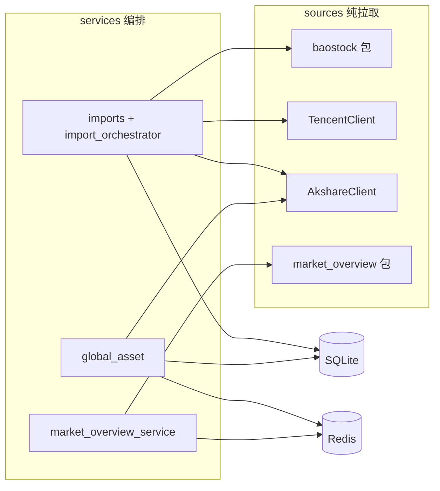

# 外部数据获取

> 范围：`backend/astock/sources/` 纯拉取层 + `services/imports/` / `services/global_asset/` / `market_overview_service.py` 编排。增量水位、Redis 缓存与导入流程详见 [reference.md — 增量同步与缓存](.agents/skills/astock/references/reference.md)。

## 阅读指引

- **改行情源 / 拉取逻辑 / 并发策略**：先看下方「30 秒速查」，再读 §2 各源说明与 §4 失败行为
- **查 API 用了哪些外部数据**：直接看 §3 调用路径
- **改导入编排 / sync_meta / Redis**：读 [reference.md — 增量同步与缓存](.agents/skills/astock/references/reference.md)，本文仅描述 sources 拉取层

## 30 秒速查（数据源 × 用途）

| 数据类型 | 外部源 | sources 模块 | 用途 | 并发 |
|---------|--------|-------------|------|------|
| 多指数收盘价 | baostock / akshare | `baostock.fetch_point` / `akshare.fetch_cn_index_point` | `point` 表（4 指数） | 单线程 |
| 三市合计成交额 | baostock 三指数 `amount` 求和 | `baostock.fetch_turnover` | `turnover` 表 | 单线程 |
| 全市场股票代码 | baostock `query_all_stock` | `baostock.fetch_all_stock_codes` | 个股切片代码池 | 单线程 |
| 个股日线成交额 | baostock `query_history_k_data_plus` | `baostock.fetch_stock_amount_history` | `stock_turnover` 切片 | **ProcessPool 4 worker** |
| 个股总市值快照 | 腾讯 `qt.gtimg.cn` | `TencentClient.fetch_market_caps` | 大市值筛选（≥1000 亿） | 60 只/批串行 |
| 美股/贵金属 ATH | akshare | `AkshareClient.fetch_stock_ath` / `fetch_metal_ath` | `asset_high` + 价格水位 | **故意串行** |
| 全球市场概览 | akshare + 东财 push2 | `market_overview.fetch_all_items` | 实时概览 API | 按项串行，项内重试 4 次 |

> A 股历史行情（点位/成交额/个股日线）已弃用 akshare 东方财富接口（限流/反爬不稳定），改用 **BaoStock + 腾讯行情** 组合。akshare 现用于科创50 点位、全球资产与市场概览。

## 1. 架构分层



- **sources/**：仅负责外部拉取与字段标准化，统一返回 `SourceFetchResult{records, ok, errors}`（`fetch_result.py`），不写库。
- **services/**：编排 sources → upsert 模型 / 写 Redis；抛 `AppError` / `ExternalSourceAppError`。
- **routers/**：薄层转发，不直接访问 sources。

### 统一返回封装

```python
@dataclass
class SourceFetchResult:
    records: list[dict]   # 成功拉取的记录
    ok: bool              # 整体是否成功（无致命错误）
    errors: list[str]     # 非致命错误（部分失败时收集）
```

约定：部分失败不抛异常，记入 `errors` 并置 `ok=False`；致命错误抛 `ExternalSourceAppError`（code `2001`）。

## 2. 各源说明

### baostock 包（A 股指数与个股日线）

- **目录**：`sources/baostock/`（`session.py`、`point_source.py`、`turnover_source.py`、`stock_source.py`）
- **超时**：`session.configure_worker_socket()` 设置 socket 30s

| 函数 | 拉取内容 | 说明 |
|------|----------|------|
| `fetch_point(index_code, start)` | 指数 `date,close` | 读取 `point_indices.yaml`，baostock 源指数 |
| `fetch_turnover(start)` | 三指数 `amount` 按日求和 | 上证 + 深证 + 创业板合计 |
| `fetch_all_stock_codes(day)` | `bs.query_all_stock` | 过滤沪深主板/创业板/科创板 |
| `fetch_stock_amount_history(code, start)` | `date,amount` 日线 | 单股历史成交额 |

个股历史拉取用 `ProcessPoolExecutor`（`STOCK_HISTORY_FETCH_WORKERS=4`）并发，worker 内调用 `configure_worker_socket()`。

### TencentClient（个股总市值快照）

- **文件**：`sources/tencent_client.py`
- **接口**：`http://qt.gtimg.cn/q=`，无需鉴权，GBK 解码
- **批量**：60 只/批（`TENCENT_BATCH_SIZE`）
- **总市值**：响应第 44 字段，单位「亿元」×1e8 转元
- **用途**：按 `MARKET_CAP_THRESHOLD`（默认 1000 亿）筛选后再用 baostock 拉日线
- **方法**：仅 `fetch_market_caps(codes)`

### AkshareClient（全球资产 ATH + 科创50 点位）

- **文件**：`sources/akshare_client.py`
- **并发**：**故意串行**——akshare 底层 mini_racer/V8 在 macOS 并发会 crash

| 方法 | 拉取内容 |
|------|----------|
| `fetch_stock_ath(symbol)` | 美股前复权 `ak.stock_us_daily(symbol, adjust="qfq")`，失败回退未复权 |
| `fetch_metal_ath(symbol)` | 外盘期货 `ak.futures_foreign_hist`（GC/SI） |
| `fetch_cn_index_point(index_code, start)` | 科创50 等 akshare 源指数日线 |
| `extract_recent_closes(df, n)` | 最近 `n` 个收盘价（`GLOBAL_ASSET_RECENT_DAYS=10`） |

提取历史最高点 + ATH 日期 + 最近收盘价，供 `services/global_asset/` 计算价格水位。

### market_overview 包（全球市场概览）

- **目录**：`sources/market_overview/`（按类目拆分 + `dispatcher.py`）
- **重试**：4 次，退避 `2s × attempt`
- **类目定义**：`backend/astock/config/market_overview.yaml`（6 类 13 项）

| source | 接口 | 覆盖 |
|--------|------|------|
| `global_index` | `ak.index_us_stock_sina`；美元指数东财 `push2his` + `push2delay` 兜底 | 道琼斯/标普/纳斯达克/美元指数 |
| `cn_index` | `ak.stock_zh_index_daily`（180 天回溯） | A 股指数 |
| `foreign_futures` | `ak.futures_foreign_hist` | 黄金 GC、白银 SI、WTI CL |
| `boc_forex` | `ak.currency_boc_sina`（央行中间价 /100） | 人民币汇率 |
| `us_bond` | `ak.bond_zh_us_rate`（5y/10y/30y） | 美债收益率 |

公开 API：`fetch_item_closes` / `fetch_all_items`（`dispatcher.py`）。

## 3. 调用路径

| API / 功能 | 入口 service | 外部数据 |
|-----------|-------------|---------|
| `POST /admin/data/import/stream?dataset=point` | `imports/point_importer` | baostock 多指数 + akshare 科创50 |
| `POST /admin/data/import/stream?dataset=turnover` | `imports/turnover_importer` | baostock 三市成交额 |
| `POST /admin/data/import/stream?dataset=stock` | `imports/stock_importer` | baostock 代码池 + 腾讯市值 + baostock 个股日线 |
| `POST /admin/data/import/stream?dataset=global_assets` | `global_asset/refresh.py` | akshare ATH + recent closes |
| `POST /admin/data/import/stream?dataset=all` | `import_orchestrator` | 四阶段顺序执行 + SSE 进度 |
| `GET /analysis/asset-price-levels` | `global_asset/query.py` | 读 DB `asset_high` + Redis 最近价（miss 时 akshare 补拉） |
| `GET /analysis/market-overview` | `market_overview_service` | `market_overview.fetch_all_items` |
| 分析类只读 API（牛市统计/排名） | `services/queries/` | **无外部请求**，纯 SQLite 聚合 |

## 4. 失败行为

| 层 | 失败时 |
|----|--------|
| sources 部分失败 | 记入 `SourceFetchResult.errors`，`ok=False`，不抛异常 |
| sources 致命错误 | 抛 `ExternalSourceAppError` |
| import 聚合 | `aggregate_status`：`success` / `partial_failure` / `failed`；全失败抛 `ExternalSourceAppError` |
| 市场概览单项 | 记入 item `error` 字段 + Redis 失败标记（`MARKET_OVERVIEW_FAILURE_TTL=300s`） |
| 全球资产单项 | 记入 `cache_errors`，`data_pending=true` 占位 |

`force_refresh` 语义（资产价/市场概览）：仅影响是否重试此前失败项，**TTL 内成功缓存始终复用**。

## 5. 新增数据源约定

1. 新建 `sources/<domain>/` 包或 `sources/<name>_client.py`，方法返回 `SourceFetchResult` 或抛 `ExternalSourceAppError`。
2. 不在 client 内操作 DB / Redis——写库归 `services/imports/` 或对应 service。
3. 部分失败收集到 `errors`，不静默吞掉。
4. 网络/限流类失败优先重试 + 退避。
5. 并发注意：akshare **串行**（macOS V8 限制）；baostock 个股历史可用多进程池。

## 6. 依赖

| 库 | 用途 |
|----|------|
| baostock | A 股指数/个股历史 |
| httpx | 腾讯行情 HTTP、东财 push2 |
| akshare | 全球资产 ATH、科创50 点位、市场概览 |
| pandas | 数据转换（service 层） |
