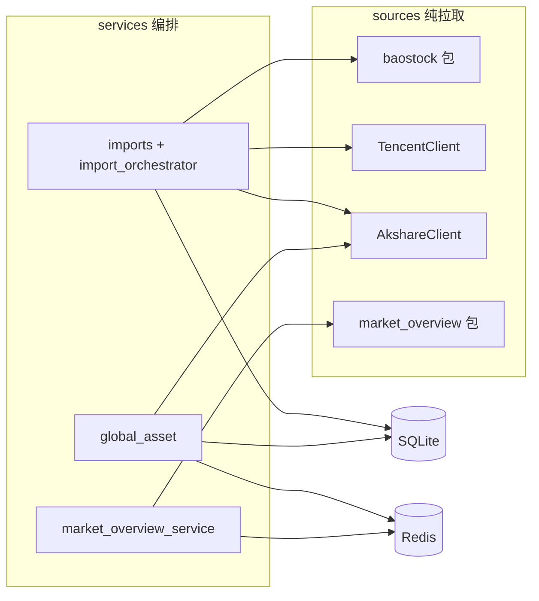
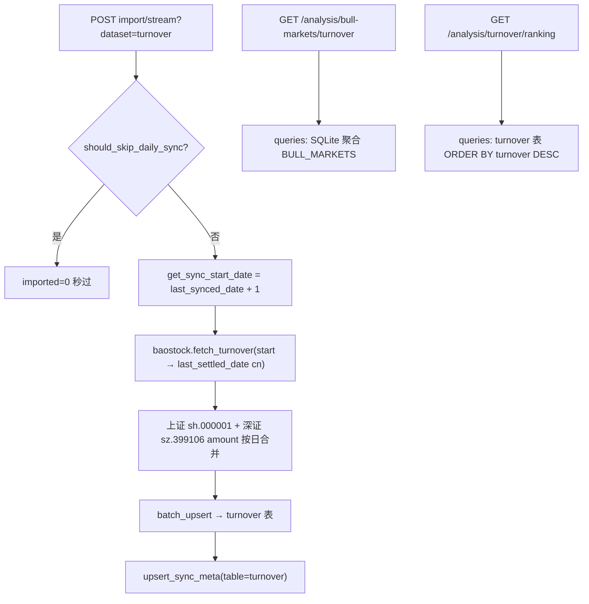
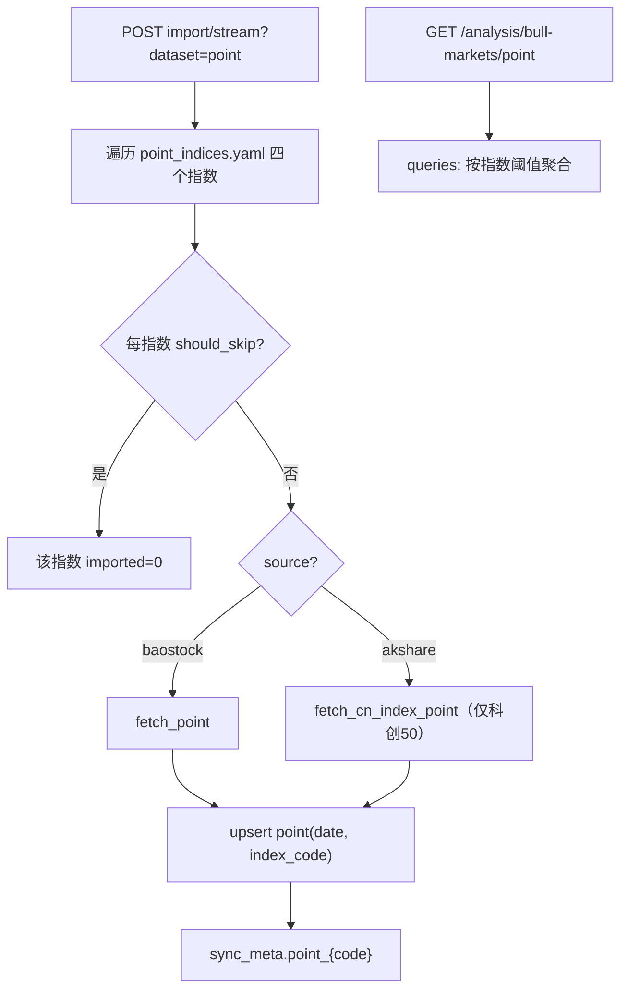
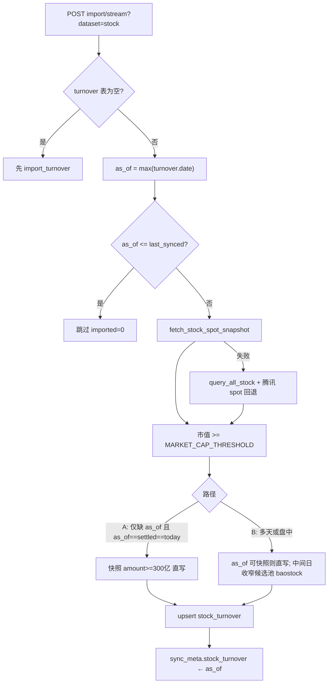
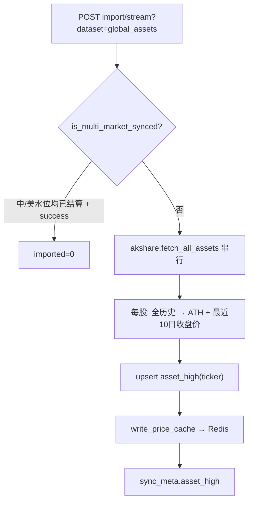
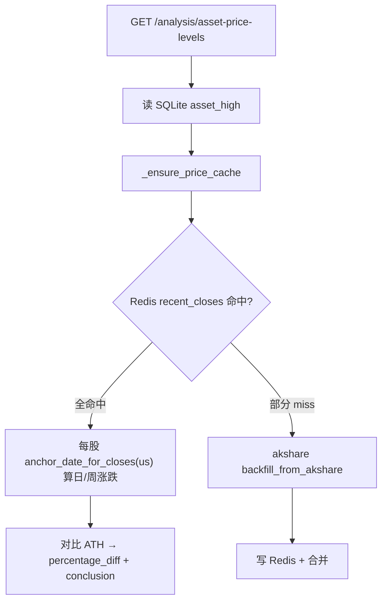
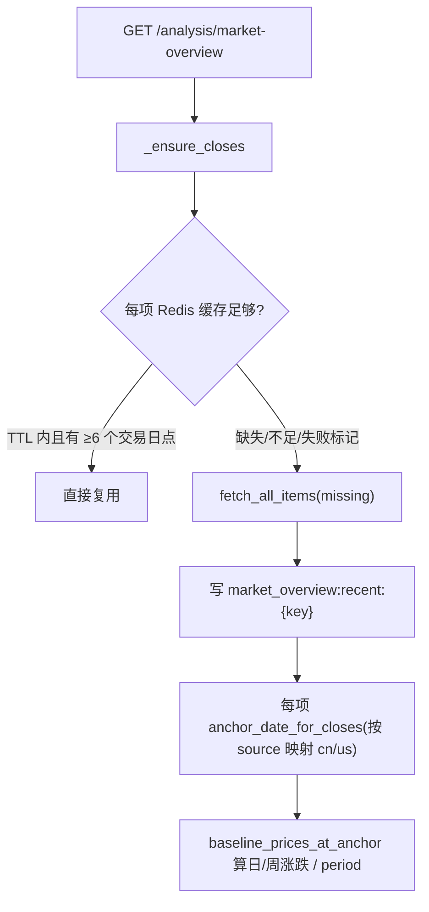

# 外部数据获取

> 范围：`backend/astock/sources/` 纯拉取层 + `services/imports/` / `services/global_asset/` / `market_overview_service.py` / `services/queries/` 编排。`sync_meta` 水位、Redis Key/TTL 明细见 [reference.md — 增量同步与缓存](.agents/skills/astock/references/reference.md)。

## 阅读指引

- **改行情源 / 拉取逻辑 / 并发策略**：先看下方「30 秒速查」，再读 §2 各源说明与 §4 失败行为
- **查某个页面/指标从哪来、怎么缓存、何时跳过**：直接读 **§7 各数据指标全流程**
- **查 API 用了哪些外部数据**：§3 调用路径 或 §7 末尾总表
- **改导入编排 / sync_meta / Redis**：读 [reference.md — 增量同步与缓存](.agents/skills/astock/references/reference.md)，本文侧重 sources 与各指标端到端流程
- **改结算日 / 盘中跳过 / 多市场时区**：读 **§1.1 非实时与分市场结算日**

## 30 秒速查（数据源 × 用途）

| 数据类型 | 外部源 | sources 模块 | 持久化 | 跳过条件（已最新时） | 并发 |
|---------|--------|-------------|--------|---------------------|------|
| 多指数收盘价 | baostock / akshare | `baostock.fetch_point` / `akshare.fetch_cn_index_point` | SQLite `point` + `sync_meta.point_{code}` | `last_synced_date ≥ last_settled_date("cn")`（按指数） | 单线程，4 指数串行 |
| 两市合计成交额 | baostock 两指数 `amount` 求和 | `baostock.fetch_turnover` | SQLite `turnover` + `sync_meta.turnover` | 同上 | 单线程 |
| 全市场个股快照 | akshare `stock_zh_a_spot_em`（失败回退腾讯） | `akshare.fetch_stock_spot_snapshot` / `TencentQuoteClient.fetch_spot_snapshot` | 不落库（筛选中间态） | — | akshare 1 次；腾讯回退 60 只/批 |
| 个股日线成交额 | baostock `query_history_k_data_plus` | `baostock.fetch_stock_amount_history` | SQLite `stock_turnover` | `turnover 最新日 ≤ last_synced` | **ProcessPool（默认 8 worker，仅 Path B）** |
| 全市场股票代码 | baostock `query_all_stock` | `baostock.fetch_all_stock_codes` | 不落库（仅腾讯回退时用） | — | 单线程 |
| 美股/贵金属 ATH | akshare | `AkshareClient.fetch_all_assets` | SQLite `asset_high` + Redis 最近价 | **`is_multi_market_synced`**（中/美水位均达标） | **故意串行** |
| 全球市场概览 | akshare + 东财 push2 | `market_overview.fetch_all_items` | **仅 Redis**（无 SQLite 导入） | TTL 内成功缓存复用 | 非美债项 ThreadPool 4；美债批量 |

> A 股**历史**日线（点位/成交额/个股区间）仍用 BaoStock；**当日全市场快照**例外使用 akshare 东财（失败回退腾讯）。akshare 另用于科创50 点位、全球资产与市场概览。

### 持久化与缓存一览

| 层 | 适用指标 | 说明 |
|----|----------|------|
| SQLite | 成交额、点位、个股切片、全球资产 ATH | 分析只读 API 主要读库；`cached_at` 为行级写入时间 |
| `sync_meta` | 上述四类导入数据集 | 记录 `last_synced_date` / `last_synced_at` / `last_status` |
| Redis | 全球资产最近价、市场概览最近价 | TTL `ASSET_PRICE_CACHE_TTL=86400s`；Redis 不可用时降级直连 akshare |
| 无缓存 | 牛市统计、成交额/个股排名 | 纯 SQLite 聚合，依赖管理员刷新导入 |

## 1. 架构分层



- **sources/**：仅负责外部拉取与字段标准化，统一返回 `SourceFetchResult{records, ok, errors}`（`fetch_result.py`），不写库。
- **services/**：编排 sources → upsert 模型 / 写 Redis；抛 `AppError` / `ExternalSourceAppError`。
- **routers/**：薄层转发，不直接访问 sources。

### 统一返回封装

```python
@dataclass
class SourceFetchResult:
    records: list[dict]   # 成功拉取的记录
    ok: bool              # 整体是否成功（无致命错误）
    errors: list[str]     # 非致命错误（部分失败时收集）
```

约定：部分失败不抛异常，记入 `errors` 并置 `ok=False`；致命错误抛 `ExternalSourceAppError`（code `2001`）。

### 1.1 非实时与分市场结算日

全站**不提供实时行情**：未完成日线的 K 线/现货价不入库、不参与涨跌计算；盘中刷新管理员导入时，已覆盖最近可结算日则跳过外部请求。

实现位于 `core/datetime_utils.py` + `services/price_utils.py`：

| 函数 / 概念 | 说明 |
|-------------|------|
| `last_settled_date(market)` | 各市场本地时区下「最近一个已收盘日」。本地 **16:00 前** → 昨日；**16:00 后** → 当日。未接入交易日历，周末按日历日推算 |
| `market` | `"cn"`：`Asia/Shanghai`（A 股导入、在岸指数、央行汇率、美债）；`"us"`：`America/New_York`（美股、外盘期货、美元指数等） |
| `market_for_source(source)` | 概览项 `source` → `cn`/`us`，见 `datetime_utils._MARKET_SOURCE` |
| `market_for_asset_type(type)` | 全球资产 `stock`/`metal` → `us` |
| `filter_settled_closes(closes, market)` | 写入/读取 Redis 与展示前剔除 `date > last_settled_date(market)` |
| `is_synced_through_settled(date, market)` | A 股类 `sync_meta` 跳过：`last_synced_date ≥ last_settled_date(market)` 且 `success` |
| `is_multi_market_synced(date)` | 全球资产导入跳过：中、美两侧 `last_settled_date` **均**已覆盖 |
| `anchor_date_for_closes(closes, market)` | **单项**锚点：该资产在对应市场结算日内的最新 `date` |
| `anchor_date_excluding_today(all_closes, markets=...)` | 多资产「数据截至」：各 key 按自身 `market` 取锚点后 `max` |

**拉取终点**：baostock / akshare 科创50 等 A 股日线 `end_date = last_settled_date("cn")`；概览 `_tail_closes(..., market=...)`、全球资产 `extract_recent_closes(..., market=...)` 按源侧市场过滤。

**注意**：日线 `date` 字段已是各市场本地交易日（美股为美东日期、A 股为北京时间日期），结算判断必须跟市场走，不能统一用上海日历「昨天」。

## 2. 各源说明

### baostock 包（A 股指数与个股日线）

- **目录**：`sources/baostock/`（`session.py`、`point_source.py`、`turnover_source.py`、`stock_source.py`）
- **超时**：`session.configure_worker_socket()` 设置 socket 30s

| 函数 | 拉取内容 | 说明 |
|------|----------|------|
| `fetch_point(index_code, start)` | 指数 `date,close` | 读取 `point_indices.yaml`，baostock 源指数 |
| `fetch_turnover(start)` | 两市指数 `amount` 按日求和 | 上证综指 `sh.000001` + 深证综指 `sz.399106`（见 `exchange_turnover_codes`） |
| `fetch_all_stock_codes(day)` | `bs.query_all_stock` | 过滤沪深主板/创业板/科创板（腾讯回退时用） |
| `fetch_stock_amount_history(code, start, end_date?)` | `date,amount` 日线 | 单股历史；`end_date` 默认 `last_settled_date("cn")` |

个股历史拉取用 `ProcessPoolExecutor`（`STOCK_HISTORY_FETCH_WORKERS`，默认 8）并发，**仅 Path B**；worker 内调用 `configure_worker_socket()`。

### TencentQuoteClient（个股快照回退）

- **文件**：`sources/tencent_client.py`
- **接口**：`http://qt.gtimg.cn/q=`，无需鉴权，GBK 解码
- **批量**：60 只/批（`TENCENT_BATCH_SIZE`）
- **字段**：名称(1)、成交额万元(37)×1e4、总市值亿元(44)×1e8
- **用途**：akshare 全市场快照失败时，配合 `query_all_stock` 回退拉取 `{code,name,amount,market_cap}`
- **方法**：`fetch_spot_snapshot` / `iter_spot_batches`；保留 `fetch_market_caps` 兼容

### AkshareClient（全球资产 ATH + 科创50 + A 股快照）

- **文件**：`sources/akshare_client.py`
- **并发**：**故意串行**——akshare 底层 mini_racer/V8 在 macOS 并发会 crash

| 方法 | 拉取内容 |
|------|----------|
| `fetch_stock_spot_snapshot()` | A 股全市场快照 `ak.stock_zh_a_spot_em` → `{code,name,amount,market_cap}` |
| `fetch_stock_ath(symbol)` | 美股前复权 `ak.stock_us_daily(symbol, adjust="qfq")`，失败回退未复权 |
| `fetch_metal_ath(symbol)` | 外盘期货 `ak.futures_foreign_hist`（GC/SI） |
| `fetch_cn_index_point(index_code, start)` | 科创50 等 akshare 源指数日线 |
| `extract_recent_closes(df, n, market=...)` | 最近 `n` 个收盘价；按 `market_for_asset_type` 截断至 `last_settled_date` |

提取历史最高点 + ATH 日期 + 最近收盘价，供 `services/global_asset/` 计算价格水位。

### market_overview 包（全球市场概览）

- **目录**：`sources/market_overview/`（按类目拆分 + `dispatcher.py`）
- **重试**：4 次，退避 `2s × attempt`
- **并发**：美债 `us_bond` 一次批量；其余项 `ThreadPoolExecutor(max_workers=4)`
- **类目定义**：`backend/astock/config/market_overview.yaml`（6 类 13 项）

| source | 接口 | 覆盖 |
|--------|------|------|
| `global_index` | `ak.index_us_stock_sina`；美元指数东财 `push2his` + `push2delay` 兜底 | 道琼斯/标普/纳斯达克/美元指数 |
| `cn_index` | `ak.stock_zh_index_daily`（180 天回溯） | A 股指数 |
| `foreign_futures` | `ak.futures_foreign_hist` | 黄金 GC、白银 SI、WTI CL |
| `boc_forex` | `ak.currency_boc_sina`（央行中间价 /100） | 人民币汇率 |
| `us_bond` | `ak.bond_zh_us_rate`（5y/10y/30y） | 美债收益率 |

公开 API：`fetch_item_closes` / `fetch_all_items`（`dispatcher.py`）。

## 3. 调用路径

| API / 功能 | 入口 service | 外部数据 | 缓存/跳过（详见 §7） |
|-----------|-------------|---------|---------------------|
| `POST /admin/data/import/stream?dataset=turnover` | `imports/turnover_importer` | baostock 两市成交额 | SQLite + `sync_meta`；`cn` 水位已结算则跳过 |
| `POST /admin/data/import/stream?dataset=point` | `imports/point_importer` | baostock 三指数 + akshare 科创50 | 按指数独立水位；`cn` 结算日跳过 |
| `POST /admin/data/import/stream?dataset=stock` | `imports/stock_importer` | 全市场快照（akshare/腾讯）+ 可选 baostock 区间 | 依赖 turnover 最新日；无新交易日跳过；Path A 0 baostock |
| `POST /admin/data/import/stream?dataset=global_assets` | `global_asset/refresh.py` | akshare ATH + recent closes | SQLite + Redis；`is_multi_market_synced` 跳过 |
| `POST /admin/data/import/stream?dataset=all` | `import_orchestrator` | 四阶段顺序执行 + SSE 进度 | 各阶段独立跳过 |
| `GET /analysis/asset-price-levels` | `global_asset/query.py` | 读 DB + Redis（miss 时 akshare 补拉） | 每股按 `us` 结算过滤；Redis TTL 86400s |
| `GET /analysis/market-overview` | `market_overview_service` | Redis（miss 时 `fetch_all_items`） | 每项独立锚点；TTL 内复用；失败冷却 300s |
| 分析类只读 API（牛市统计/排名） | `services/queries/` | **无外部请求**，纯 SQLite 聚合 | — |

## 4. 失败行为

| 层 | 失败时 |
|----|--------|
| sources 部分失败 | 记入 `SourceFetchResult.errors`，`ok=False`，不抛异常 |
| sources 致命错误 | 抛 `ExternalSourceAppError` |
| import 聚合 | `aggregate_status`：`success` / `partial_failure` / `failed`；全失败抛 `ExternalSourceAppError` |
| 市场概览单项 | 记入 item `error` 字段 + Redis 失败标记（`MARKET_OVERVIEW_FAILURE_TTL=300s`） |
| 全球资产单项 | 记入 `cache_errors`，`data_pending=true` 占位 |

`force_refresh` 语义（资产价/市场概览）：仅影响是否重试此前失败项，**TTL 内成功缓存始终复用**。

## 5. 新增数据源约定

1. 新建 `sources/<domain>/` 包或 `sources/<name>_client.py`，方法返回 `SourceFetchResult` 或抛 `ExternalSourceAppError`。
2. 不在 client 内操作 DB / Redis——写库归 `services/imports/` 或对应 service。
3. 部分失败收集到 `errors`，不静默吞掉。
4. 网络/限流类失败优先重试 + 退避。
5. 并发注意：akshare **串行**（macOS V8 限制）；baostock 个股历史可用多进程池。

## 6. 依赖

| 库 | 用途 |
|----|------|
| baostock | A 股指数/个股历史 |
| httpx | 腾讯行情 HTTP、东财 push2 |
| akshare | 全球资产 ATH、科创50 点位、市场概览 |
| pandas | 数据转换（service 层） |

## 7. 各数据指标全流程

本节按**前端可见指标**描述：触发入口 → 外部拉取 → 持久化/缓存 → 跳过条件 → 只读查询。配置清单见 `config/point_indices.yaml`、`config/global_assets.yaml`、`config/market_overview.yaml`、`config/bull_markets.yaml`。

### 7.1 两市成交额（`turnover`）

**页面**：牛市成交额统计、大盘成交额 TopN、个股切片的前置依赖。



| 项 | 说明 |
|----|------|
| 外部源 | baostock `query_history_k_data_plus`，指数见 `settings.yaml → mappings.exchange_turnover_codes` |
| 输出字段 | `date`, `sse_amount`, `szse_amount`, `turnover`（两市合计）, `cached_at` |
| 增量水位 | `sync_meta.table_name = turnover`；起点 **`last_synced_date + 1 日`**（不含已同步日） |
| 跳过 | `should_skip_daily_sync` → `is_synced_through_settled(last_synced_date, "cn")` 且上次 `success` |
| 缓存 | **仅 SQLite**，无 Redis；读 API 不触网 |
| 阈值 | 牛市达标默认 `TURNOVER_THRESHOLD = 2e12`（2 万亿） |

### 7.2 多指数收盘价（`point`）

**页面**：牛市点位统计（上证 / 沪深300 / 创业板 / 科创50）。



| 指数 | 代码 | 数据源 | sync_meta key |
|------|------|--------|---------------|
| 上证指数 | 000001 | baostock `sh.000001` | `point_000001` |
| 沪深300 | 000300 | baostock `sh.000300` | `point_000300` |
| 创业板指 | 399006 | baostock `sz.399006` | `point_399006` |
| 科创50 | 000688 | akshare `stock_zh_index_daily` | `point_000688` |

| 项 | 说明 |
|----|------|
| 增量 / 跳过 | 与成交额相同（`cn` 结算日），**按指数独立**判断与拉取；`end_date=last_settled_date("cn")` |
| 缓存 | **仅 SQLite**；`GET /admin/data/sync-status` 中 `point` 项取各指数水位聚合（`max(last_synced_date)`） |
| 阈值 | 各指数 `default_threshold` 见 `point_indices.yaml`；API 可传 `threshold_{code}` 覆盖 |

### 7.3 个股高成交额切片（`stock` / `stock_turnover`）

**页面**：个股成交额 TopN。



| 项 | 说明 |
|----|------|
| 交易日锚点 | **成交额表最新日期** `as_of_date`（非日历今天） |
| 跳过 | `stock_turnover.last_synced_date` 已 ≥ `as_of_date` → 无新交易日，不拉快照/baostock |
| 快照源 | 主路径 `ak.stock_zh_a_spot_em` **1 次**；失败回退腾讯批量（需 `query_all_stock`） |
| 路径 A | `as_of == last_settled_date("cn") == today_local()`，且 `last_synced` 与 `as_of` 之间无其它 turnover 交易日 → **0 baostock**，快照直写 |
| 路径 B | 多天缺口或盘中：as_of 可结算则快照直写；中间日 `hist_start→hist_end` baostock；候选池 = 市值≥1000亿 ∧ (快照成交额≥100亿 ∨ 历史切片 code) |
| 筛选 | 市值 ≥ `1e11`（1000 亿）；日成交额切片 ≥ `3e10`（300 亿） |
| 缓存 | **仅 SQLite**；读排名 `GET /analysis/stock/ranking` 纯查库 |
| SSE | Path B 每 5 只股票上报进度；腾讯回退时按批上报 |

### 7.4 全球资产历史最高点 + 价格水位（`global_assets`）

**页面**：全球资产价格水位（距 ATH 百分比、日/周涨跌、结论标签）。

**写路径（管理员导入）**：



**读路径（用户打开页面）**：



| 项 | 说明 |
|----|------|
| 资产清单 | `global_assets.yaml`：20 只美股 + 黄金/白银（`GC`/`SI`） |
| 导入跳过 | `refresh_asset_highs`：`last_status=success` 且 `is_multi_market_synced(last_synced_date)` 且表非空 |
| 结算市场 | 美股 `stock`、贵金属 `metal` → `us`；写/读 Redis 前 `filter_settled_closes(..., market)` |
| 展示锚点 | 每股 `anchor_date_for_closes(closes, market)` + `baseline_prices_at_anchor` |
| `latest_trading_date` | 响应字段：`anchor_date_excluding_today(..., markets=global_asset_markets)`，不超过 `max(cn, us)` 结算日 |
| Redis Key | `global_asset:recent:{ticker}`（最近 N 日收盘价 JSON）；`global_asset:price:{ticker}:{date}`（逐日兜底）；`global_asset:meta:latest_trading_date` |
| TTL | `ASSET_PRICE_CACHE_TTL = 86400s`（环境变量 `asset_price_cache_ttl`） |
| `force_refresh` | 读 API 参数：忽略 Redis 未命中时的惰性，**强制** akshare 补拉；**不**绕过 TTL 内已有成功缓存（与概览一致） |
| 结论标签 | `percentage_diff` 绝对值对照 `price_level_conclusions`（5%/20%/50% 档） |

### 7.5 全球市场概览（13 项，6 类）

**页面**：全球市场概览。**无 SQLite 导入阶段**，打开页面或 `force_refresh` 时按需拉取。



| 类目 | 项 | source 模块 | 外部接口 |
|------|-----|-------------|----------|
| 美股 | 道琼斯、标普、纳斯达克 | `global_index` | `ak.index_us_stock_sina`；美元指数东财 push2his + push2delay |
| A股 | 上证、沪深300、创业板、科创板 | `cn_index` | `ak.stock_zh_index_daily`（回溯 `CN_INDEX_LOOKBACK_DAYS=180`） |
| 贵金属 | 黄金、白银 | `foreign_futures` | `ak.futures_foreign_hist` |
| 汇率 | 美元指数、美元/人民币 | `global_index` / `boc_forex` | 东财 / `ak.currency_boc_sina`（中间价 ÷100） |
| 大宗 | WTI 原油 | `foreign_futures` | `ak.futures_foreign_hist`（CL） |
| 债券 | 美债 5y/10y/30y | `us_bond` | `ak.bond_zh_us_rate`（一次拉取填三项） |

| 项 | 说明 |
|----|------|
| Redis Key | `market_overview:recent:{category_key}:{code}`；`market_overview:meta:latest_trading_date` |
| 失败冷却 | `market_overview:failure:{key}`，TTL `MARKET_OVERVIEW_FAILURE_TTL=300s`；默认模式下带标记项不重复打源 |
| `force_refresh` | **仅**对「缓存不足 / 无缓存 / 有失败标记」的项重试；**TTL 内成功项始终复用** |
| 结算过滤 | 抓取层 `_tail_closes(..., market=...)`；缓存读写带 `market_for_source(source)` |
| 锚点日 | **按项独立** `anchor_date_for_closes(closes, market)`，不再用全局单一锚点强行对齐美股/A 股 |
| `latest_trading_date` | 响应优先 `anchor_date_excluding_today(..., markets=overview_item_markets)`，兜底 `last_settled_date("cn")` |
| 并发 | 美债单独批量；其余项 `ThreadPoolExecutor(max_workers=4)`；单项内重试 `FETCH_RETRIES=4`，退避 `2s×attempt` |

**source → market 映射**（`datetime_utils._MARKET_SOURCE`）：

| source | market | 典型项 |
|--------|--------|--------|
| `cn_index` | `cn` | 上证、沪深300、创业板、科创板 |
| `boc_forex` | `cn` | 美元/人民币 |
| `us_bond` | `cn` | 美债 5y/10y/30y（在岸数据源日频） |
| `global_index` | `us` | 道琼斯、标普、纳斯达克、美元指数 |
| `foreign_futures` | `us` | 黄金、白银、WTI |

### 7.6 只读分析指标（无外部请求）

以下 API **不访问 sources**，仅依赖 SQLite 已导入数据；数据新鲜度由管理员 SSE 刷新保证。

| 指标 | API | 数据表 | 逻辑摘要 |
|------|-----|--------|----------|
| 牛市成交额达标天数/极值 | `GET /analysis/bull-markets/turnover` | `turnover` | 按 `bull_markets.yaml` 区间统计 `turnover > threshold` |
| 牛市多指数点位达标 | `GET /analysis/bull-markets/point` | `point` | 每指数独立阈值；`available_from` 控制历史区间是否可用 |
| 大盘成交额 TopN | `GET /analysis/turnover/ranking` | `turnover` | 可按牛市区间过滤 |
| 个股成交额 TopN | `GET /analysis/stock/ranking` | `stock_turnover` | 高水位切片排名 |

同步状态展示：`GET /admin/data/sync-status` 读 `sync_meta`（点位为各指数聚合），前端 `sync-meta.ts` 渲染卡片 extra。

### 7.7 全量刷新编排（`dataset=all`）

`import_orchestrator.import_dataset_stream` **固定顺序**：

1. `turnover` → 2. `point` → 3. `stock` → 4. `global_assets`

每阶段经 `ProgressReporter` 推送 SSE `progress` 事件（`phase` / `imported` / `elapsed` / `last_date`）。`stock` 阶段为生成器，步骤间 `SSEBridge` 保活。

### 7.8 指标 × 存储 × 触网时机总表

| 指标 | 写入触发 | SQLite 表 | sync_meta | Redis | 用户读 API 是否触网 |
|------|----------|-----------|-----------|-------|---------------------|
| 成交额 | 管理员导入 | `turnover` | `turnover` | — | 否 |
| 指数点位 | 管理员导入 | `point` | `point_{code}` | — | 否 |
| 个股切片 | 管理员导入 | `stock_turnover` | `stock_turnover` | — | 否 |
| 全球资产 ATH | 管理员导入 | `asset_high` | `asset_high` | 最近价 | 仅 Redis miss 时 akshare 补拉 |
| 市场概览 | **无导入** | — | — | 最近价 | 缓存 miss / 不足 / 强制重试失败项 |
| 牛市统计/排名 | — | 读上表 | — | — | 否 |

### 7.9 跳过逻辑对照（避免重复拉取）

| 数据集 | 条件 | 行为 |
|--------|------|------|
| turnover / point | `is_synced_through_settled(last_synced_date, "cn")` 且 `last_status=success` | 不请求 baostock/akshare，`imported=0`；拉取 `end_date=last_settled_date("cn")` |
| stock | `max(turnover.date) <= stock_turnover.last_synced_date` | 不请求快照/baostock，`imported=0`（间接依赖 A 股 `cn` 水位） |
| global_assets | `is_multi_market_synced(last_synced_date)` 且 `last_status=success` 且表非空 | 不请求 akshare，`imported=0` |
| market_overview | 各项 Redis 缓存 TTL 内且 `has_sufficient_baseline_points(..., market=...)` | 不请求外部源；`force_refresh` 不刷新已成功项 |
