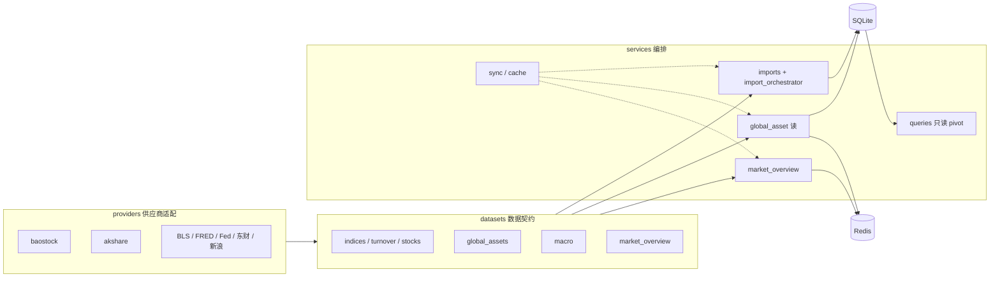
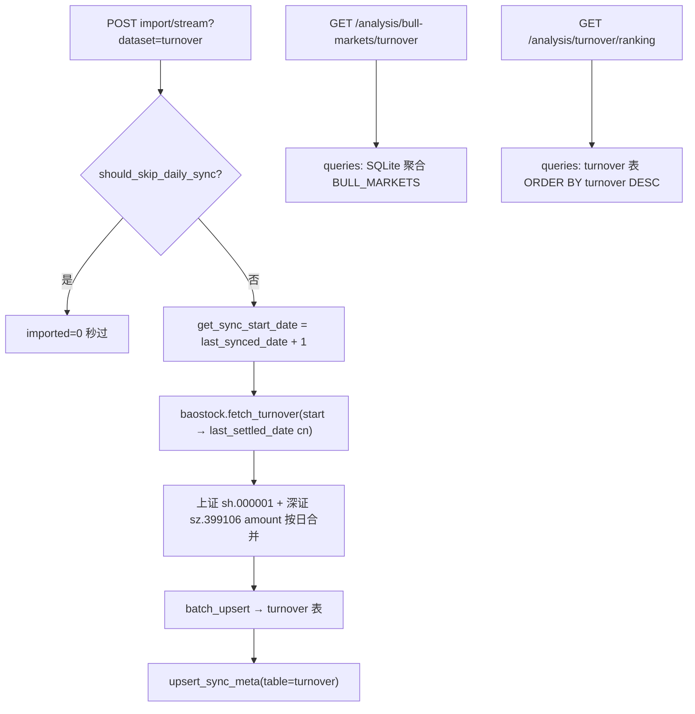
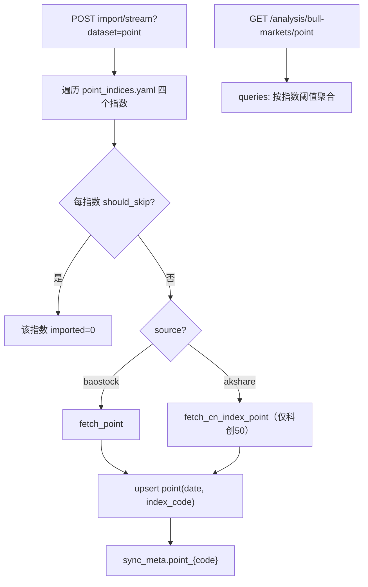
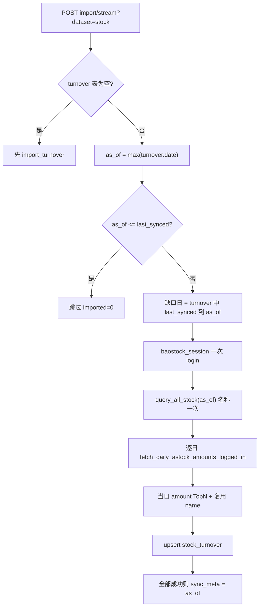
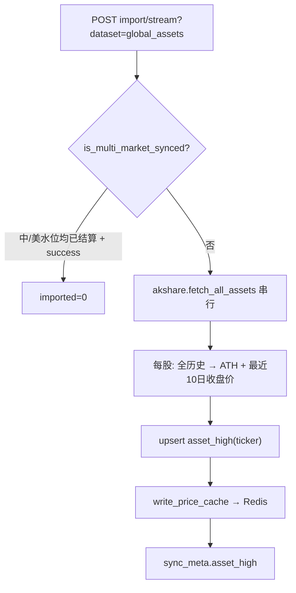
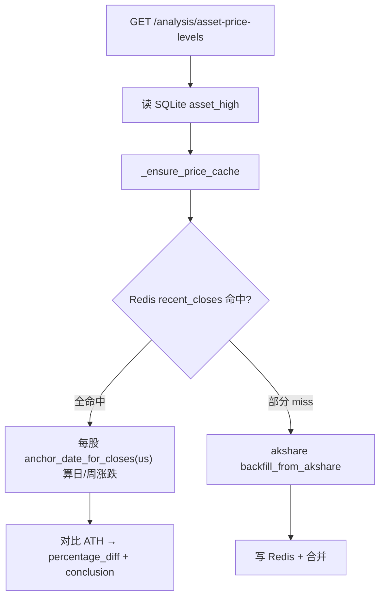
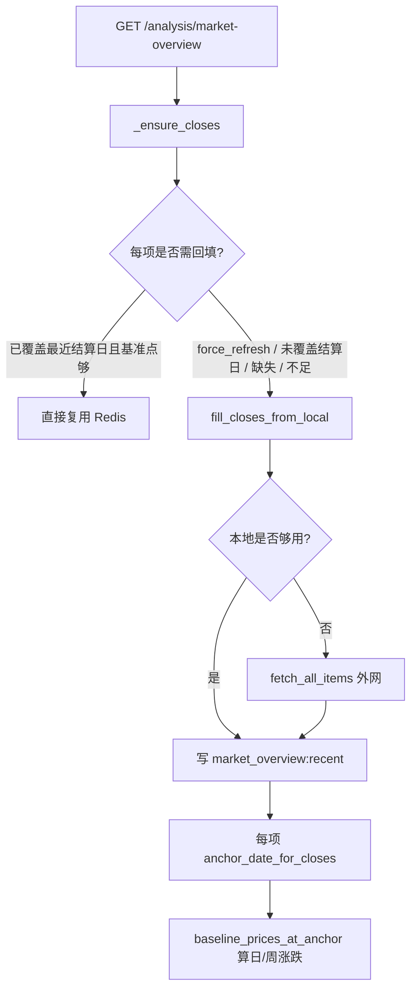
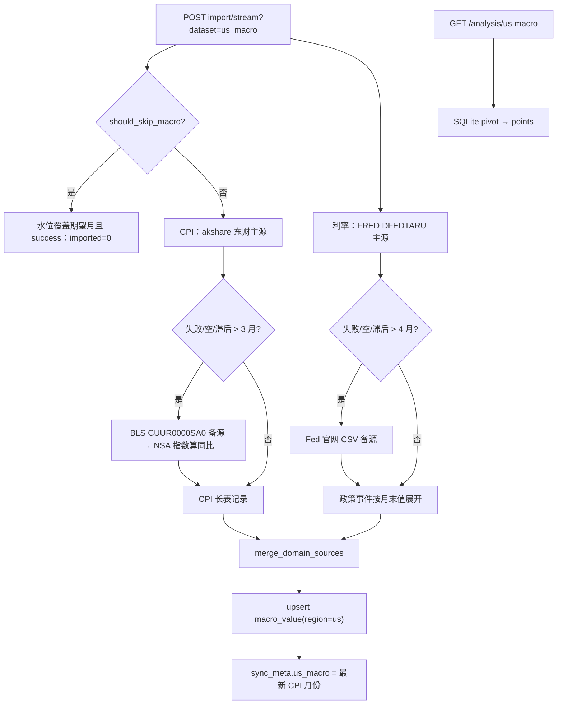
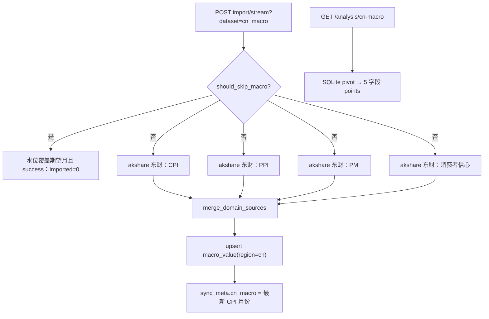

# 外部数据获取

> 范围：`backend/astock/providers/`（供应商适配）+ `backend/astock/datasets/`（稳定数据契约）+ `services/imports/` / `services/global_asset/` / `services/market_overview/` / `services/queries/` 编排。`sync_meta` 水位、Redis Key/TTL 明细见 [reference.md — 增量同步与缓存](.agents/skills/astock/references/reference.md)。

## 阅读指引

- **改行情源 / 拉取逻辑 / 并发策略**：先看下方「30 秒速查」，再读 §2 各源说明与 §4 失败行为
- **查某个页面/指标从哪来、怎么缓存、何时跳过**：直接读 **§7 各数据指标全流程**
- **查 API 用了哪些外部数据**：§3 调用路径 或 §7 末尾总表
- **改导入编排 / sync_meta / Redis**：读 [reference.md — 增量同步与缓存](.agents/skills/astock/references/reference.md)，本文侧重 providers/datasets 与各指标端到端流程
- **改结算日 / 盘中跳过 / 多市场时区**：读 **§1.1 非实时与分市场结算日**

## 30 秒速查（数据源 × 用途）

多源场景拆成多行：`角色` 标明主/备/专供哪一段；`选用原因` 写清为何不用单一源。单源行 `角色` 为空。

| 数据类型 | 角色 | 外部源 | datasets 模块 | 选用原因 | 持久化 | 跳过条件（已最新时） | 并发 |
|---------|------|--------|-------------|----------|--------|---------------------|------|
| 多指数收盘价 | 主·三指数 | baostock | `datasets.indices.fetch_point` | A 股历史日线主源；覆盖上证 / 沪深300 / 创业板 | SQLite `point` + `sync_meta.point_{code}` | 按指数：`last_synced_date ≥ last_settled_date("cn")` | 4 指数串行 |
| ↳ | 专供·科创50 | akshare（新浪日线） | 同上（按 `point_indices.yaml` 的 `source` 分发） | baostock 对 `sh.000688` 调通但 **0 行**（库未覆盖科创50）；勿用 `sz.000688`（个股国城矿业） | 同上 | 同上（独立水位 `point_000688`） | 同上串行 |
| 两市合计成交额 | — | baostock 两指数 `amount` 求和 | `datasets.turnover.fetch_turnover` | 上证综指 + 深证综指 amount ≈ 两市全市场成交额 | SQLite `turnover` + `sync_meta.turnover` | 同上 `cn` 结算日 | 单线程 |
| 个股高成交额切片 | — | baostock 日更 `query_daily_history_k_AStock` | `datasets.stocks.fetch_daily_astock_amounts_logged_in` | 缺口整段共用一次 login；逐日全市场 amount TopN（默认 20） | SQLite `stock_turnover` | `max(turnover.date) ≤ last_synced` | 单 session 串行 |
| 全市场股票名称 | 服务个股切片 | baostock `query_all_stock` | `datasets.stocks.fetch_all_stock_codes_logged_in` | 日 K 无名称；按 `as_of` 拉一次，缺口期内复用 | 不落库 | — | 同 session 一次 |
| 美股/贵金属 ATH | — | akshare | `datasets.global_assets.fetch_all_assets` | 美股日线 + 外盘期货（GC/SI）同一套接口拿 ATH 与近期收盘 | SQLite `asset_high` + Redis | **`is_multi_market_synced`**（中/美均达标） | **故意串行**（macOS V8） |
| 中国宏观月度 | — | akshare 的东财宏观接口 | `datasets.macro.fetch_cn_macro` | CPI/PPI/PMI/消费者信心四个子源，标准化成长表写入 `macro_value` | SQLite + `sync_meta.cn_macro` | `success` 且 CPI 水位覆盖 `expected_macro_period` | 串行 |
| 美国宏观·CPI | 主/备 | akshare 东财 / BLS Public API | `datasets.macro.us_cpi` | 东财主源失败、空或滞后超过 3 个月时回退 BLS NSA 指数并自行计算同比 | SQLite + `sync_meta.us_macro` | 同上，默认每月 15 日切换期望月 | 串行 |
| 美国宏观·政策利率 | 主/备 | FRED / Fed 官网 CSV | `datasets.macro.us_rates` | DFEDTARU 主源失败、空或滞后超过 4 个月时回退官网；事件序列按月末值展开 | 同上 | 与美国 CPI 合并为同一 dataset | 串行 |
| 市场概览·美股三指数 | — | akshare `index_us_stock_sina` | `datasets.market_overview.global_index` | 道指/标普/纳指有稳定新浪符号（`.DJI`/`.INX`/`.IXIC`） | **仅 Redis** | 项级 `closes_cover_settled`；缺项先本地再外网 | darwin 串行 / Linux 并行（与非美债项共享） |
| 市场概览·A股指数 | ①主·本地 | SQLite `point` | `services/market_overview/local_closes` | 四指数（含科创50）点位导入已入库；概览优先读库 | 同上 | 本地覆盖结算日且基准够则跳过外网 | — |
| ↳ | ②备·外网 | akshare `stock_zh_index_daily` | `datasets.market_overview.cn_index` | 库不足时回退；与点位科创50同底层 | 同上 | 同上 | 同非美债批次 |
| 市场概览·贵金属 | ①主·本地 | 全球资产 Redis | `local_closes`（读 `global_asset:recent`） | GC/SI 与全球资产共用；导入后可复用 | 同上 | 本地够用则跳过外网 | — |
| ↳ | ②备·外网 / 原油 | akshare `futures_foreign_hist` | `datasets.market_overview.foreign_futures` | WTI(CL) 无全球资产缓存；GC/SI 本地不足时回退 | 同上 | 同上 | 同非美债批次 |
| 市场概览·人民币汇率 | — | akshare `currency_boc_sina` | `datasets.market_overview.boc_forex` | 央行中间价日频，÷100 后展示 | 同上 | 同上 | 同非美债批次 |
| 市场概览·美债/中债 | — | akshare `bond_zh_us_rate` | `datasets.market_overview.us_bond` | **一次**批量出美债+中债 2y/10y/30y | 同上 | 同上 | **单独批量**（不进线程池） |
| 市场概览·美元指数历史 | ①主 | 新浪 DINIW 日线 | `usd_index`（经 `global_index`） | 生产机东财/akshare 常不可达，新浪日线最稳 | 同上 | 同上 | 同非美债批次 |
| ↳ | ②备 | akshare `index_global_hist_em` | 同上 | 新浪失败时的日线兜底 | 同上 | 同上 | 同上 |
| ↳ | ③备 | 东财 push2his（多 host） | 同上 | akshare 也失败时再试东财 K 线 | 同上 | 同上 | 同上 |
| 市场概览·美元指数现货 | 补丁·①② | 新浪 hq → 东财 push2delay | 同上 | **仅当**历史未盖住 `us` 结算日或基准点不足时合并；够用则不打现货 | 同上 | 同上 | 同上 |

### 持久化与缓存一览

| 层 | 适用指标 | 说明 |
|----|----------|------|
| SQLite | 成交额、点位、个股切片、全球资产 ATH、宏观月度 | 分析只读 API 主要读库；`cached_at` 为行级写入时间 |
| `sync_meta` | 上述导入数据集 | 记录 `last_synced_date` / `last_synced_at` / `last_status` |
| Redis | 全球资产最近价、市场概览最近价 | TTL `ASSET_PRICE_CACHE_TTL=86400s`；缓存未覆盖结算日时回填外部源（概览美元指数优先新浪） |
| 无缓存 | 牛市统计、成交额/个股排名 | 纯 SQLite 聚合，依赖管理员刷新导入 |

## 1. 架构分层


```mermaid
flowchart LR
  subgraph providers [providers 供应商适配]
    bao[baostock]
    ak[akshare]
    http[BLS / FRED / Fed / 东财 / 新浪]
  end
  subgraph datasets [datasets 数据契约]
    idx[indices / turnover / stocks]
    ga[global_assets]
    macro[macro]
    mo[market_overview]
  end
  subgraph services [services 编排]
    imp[imports + import_orchestrator]
    qry[queries 只读 pivot]
    gas[global_asset 读]
    mos[market_overview]
    sync[sync / cache]
  end
  providers --> datasets
  datasets --> imp
  datasets --> gas
  datasets --> mos
  imp --> SQLite[(SQLite)]
  SQLite --> qry
  gas --> SQLite
  gas --> Redis[(Redis)]
  mos --> Redis
  sync -.-> imp
  sync -.-> gas
  sync -.-> mos
```

- **providers/**：隔离外部 SDK/HTTP，返回原始或中性数据；不依赖 `datasets/`、`models/`、`services/`，不构造业务记录形状。
- **datasets/**：按稳定数据契约做多源选择与标准化；import 路径统一返回 `FetchResult{records, ok, errors}`（`datasets/result.py`），不写库、不依赖 services。
- **services/**：编排 datasets → upsert 模型 / 写 Redis；日频导入走 `imports/pipeline.run_daily_import`；抛 `AppError` / `ExternalSourceAppError`。
- **routers/**：薄层转发，不直接访问 providers/datasets。

### 文件粒度规则

- 默认扁平文件；普通文件目标约 80～250 行；超过约 300 行且有两个独立职责时拆分。
- 独立外部 API 契约（如 BLS/FRED）允许保持小文件。
- 至少 3 个相关模块或存在共享入口时再建子包（当前：`macro/`、`market_overview/`、`providers/baostock/`、`providers/akshare/`）。

### 遗留 `sources/` 目录

`backend/astock/sources/` 是迁移前实现，目录内部仍有自引用，但当前 routers/services 的运行链路已切到 `providers/` + `datasets/`。新增或修改数据源不要继续扩展 `sources/`；判断真实调用关系时以 service 的 import 链为准。

### 统一返回封装

```python
@dataclass
class FetchResult:
    records: list[dict]   # 成功拉取的记录
    ok: bool              # 整体是否成功（无致命错误）
    errors: list[str]     # 非致命错误（部分失败时收集）
```

约定：部分失败不抛异常，记入 `errors` 并置 `ok=False`；致命错误抛 `ExternalSourceAppError`（code `2001`）。

### 1.1 非实时与分市场结算日

全站**不提供实时行情**：未完成日线的 K 线/现货价不入库、不参与涨跌计算；盘中刷新管理员导入时，已覆盖最近可结算日则跳过外部请求。

实现位于 `core/datetime_utils.py` + `core/price_utils.py`（纯函数）+ `services/cache/closes.py`（Redis closes 读写 / ensure）：

| 函数 / 概念 | 说明 |
|-------------|------|
| `last_settled_date(market)` | 各市场本地时区下「最近一个已收盘**交易日**」。`cn`：**20:00 前** → 昨日、**20:00 后** → 当日为候选上界（避开 A 股日线源收盘后空窗）；`us`：美东 **16:00** 前后同理。候选日经 `exchange_calendars`（`XSHG` / `XNYS`，见 `core/trading_calendar.py`）回退到最近 session，跳过周末与休市 |
| `market` | `"cn"`：`Asia/Shanghai`（A 股导入、在岸指数、央行汇率、美债）；`"us"`：`America/New_York`（美股、外盘期货、美元指数等） |
| `market_for_source(source)` | 概览项 `source` → `cn`/`us`，见 `datetime_utils._MARKET_SOURCE` |
| `market_for_asset_type(type)` | 全球资产 `stock`/`metal` → `us` |
| `filter_settled_closes(closes, market)` | 写入/读取 Redis 与展示前剔除 `date > last_settled_date(market)` |
| `is_synced_through_settled(date, market)` | A 股类 `sync_meta` 跳过：`last_synced_date ≥ last_settled_date(market)` 且 `success` |
| `is_multi_market_synced(date)` | 全球资产导入跳过：中、美两侧 `last_settled_date` **均**已覆盖 |
| `anchor_date_for_closes(closes, market)` | **单项**锚点：该资产在对应市场结算日内的最新 `date` |
| `anchor_date_excluding_today(all_closes, markets=...)` | 多资产「数据截至」：各 key 按自身 `market` 取锚点后 `max` |

**拉取终点**：baostock / akshare 科创50 等 A 股日线 `end_date = last_settled_date("cn")`；概览 `tail_closes(..., market=...)`、全球资产近期收盘价按 `market_for_asset_type` 截断至 `last_settled_date`。

**注意**：日线 `date` 字段已是各市场本地交易日（美股为美东日期、A 股为北京时间日期），结算判断必须跟市场走，不能统一用上海日历「昨天」。

## 2. 各源说明

### providers/baostock（A 股原始查询）

- **目录**：`providers/baostock/`（`client.py`、`market.py`、`stocks.py`）
- **超时**：`client.configure_worker_socket()` 设置 socket 30s（需 **baostock≥0.9.3** 才有日更全市场 API）
- **会话**：`baostock_session()` 可重入；`baostock_session_hold()` 经 `datasets.stocks` 暴露给编排层。**禁止**多线程并发调 baostock（全局单 socket）

数据集入口：`datasets.indices.fetch_point`、`datasets.turnover.fetch_turnover`、`datasets.stocks.*`。

### providers/akshare（全球资产 / 指数 / 宏观原始查询）

- **目录**：`providers/akshare/`（`market.py`、`assets.py`、`economics.py`）
- **并发**：**故意串行**——akshare 底层 mini_racer/V8 在 macOS 并发会 crash
- **共享**：`providers/_shared/retry.py`、`symbols.py`、`http.py`、`parsing.py`

数据集入口：`datasets.global_assets`、`datasets.macro`、`datasets.market_overview`、`datasets.indices`（科创50）。

### providers HTTP 适配（BLS / FRED / Fed / 东财 / 新浪）

| 模块 | 用途 |
|------|------|
| `providers/bls.py` | BLS `CUUR0000SA0` 美国 CPI 未季调指数；按最多 10 年窗口拉取 |
| `providers/fred.py` | FRED `DFEDTARU` 联邦基金目标利率上限事件 |
| `providers/federal_reserve.py` | 美联储官网目标利率静态 CSV 备源 |
| `providers/eastmoney.py` | 美元指数现货 / K 线 |
| `providers/sina.py` | DINIW 现货 / 日线 |

### datasets/market_overview（全球市场概览）

- **目录**：`datasets/market_overview/`（`dispatcher.py` + 按 source 拆分）；本地优先在 `services/market_overview/local_closes.py`
- **重试**：`FETCH_RETRIES=4`，退避 `FETCH_RETRY_DELAY=2s × attempt`（`providers/_shared/retry.py`）
- **并发**：美债 `us_bond` 一次批量；其余项 **darwin 串行 / Linux 小线程池（max 4）**
- **类目定义**：`backend/astock/config/market_overview.yaml`（6 类 **18** 项）
- **本地优先**：回填前 `fill_closes_from_local`——A 股四指数读 SQLite `point`；GC/SI 读全球资产 Redis；不足再外网

| source | 接口 | 覆盖 |
|--------|------|------|
| `global_index` | 美股三指数：`ak.index_us_stock_sina`；美元指数走 `usd_index.fetch_usd_index` | 道琼斯/标普/纳斯达克/美元指数 |
| `cn_index` | 优先 `point` 表；不足再 `ak.stock_zh_index_daily` | A 股指数（含科创50） |
| `foreign_futures` | GC/SI 优先全球资产 Redis；不足或 WTI 再 `ak.futures_foreign_hist` | 黄金 GC、白银 SI、WTI CL |
| `boc_forex` | `ak.currency_boc_sina`（央行中间价 ÷100） | 人民币汇率 |
| `us_bond` | `ak.bond_zh_us_rate`（一次拉取填美债+中债 2y/10y/30y） | 债券收益率 |

**美元指数（`usd_index.py`）**：日线历史为主，现货仅补丁。

| 阶段 | 优先级 | 接口 |
|------|--------|------|
| 历史 | ① 新浪 → ② akshare → ③ 东财 | `providers.sina` → `providers.akshare.market` → `providers.eastmoney` |
| 现货补丁 | 仅当历史未覆盖 `last_settled_date("us")` 或基准点不足 | ① 新浪 → ② 东财 |
| 配置 | `settings.yaml → api.eastmoney` | `hist_hosts` / `delay_host` / `usd_history_timeout` / `usd_spot_timeout` |

公开 API：`fetch_item_closes` / `fetch_all_items`（返回 `(closes, errors)`，services 包装为 `ClosesFetchResult`）。

## 3. 调用路径

| API / 功能 | 入口 service | 外部数据 | 缓存/跳过（详见 §7） |
|-----------|-------------|---------|---------------------|
| `POST /admin/data/import/stream?dataset=turnover` | `imports/turnover`（`pipeline.run_daily_import`） | baostock 两市成交额 | SQLite + `sync_meta`；`cn` 水位已结算则跳过 |
| `POST /admin/data/import/stream?dataset=point` | `imports/point` | baostock 三指数 + akshare 科创50 | 按指数独立水位；`cn` 结算日跳过 |
| `POST /admin/data/import/stream?dataset=stock` | `imports/stock/` | baostock 日更全市场 TopN + `query_all_stock` 名称 | 依赖 turnover 最新日；无新交易日跳过 |
| `POST /admin/data/import/stream?dataset=global_assets` | `imports/global_assets.py` | akshare ATH + recent closes | SQLite + Redis；`is_multi_market_synced` 跳过 |
| `POST /admin/data/import/stream?dataset=us_macro` | `imports/us_macro` → `_macro_domain` | CPI：东财→BLS；利率：FRED→Fed 官网 | SQLite `macro_value` + `sync_meta.us_macro`；月频期望水位 |
| `POST /admin/data/import/stream?dataset=cn_macro` | `imports/cn_macro` → `_macro_domain` | akshare 东财 CPI/PPI/PMI/消费者信心 | SQLite `macro_value` + `sync_meta.cn_macro`；月频期望水位 |
| `POST /admin/data/import/stream?dataset=all` | `import_orchestrator` | baostock 三段共享 login；之后全球资产、美国宏观、中国宏观在主线程串行；结束后 `warmup_market_overview` | 六阶段各自跳过；概览预热仅补落后项 |
| `GET /analysis/asset-price-levels` | `global_asset/query.py` | 读 DB + Redis（miss 时 akshare 补拉） | 每股按 `us` 结算过滤；`force_refresh` 全部重拉；Redis TTL 86400s |
| `GET /analysis/market-overview` | `market_overview/service` | Redis（未覆盖结算日 / 不足时：本地 point/全球资产 → `fetch_all_items`） | 每项独立锚点；`closes_cover_settled` 复用；失败冷却 300s；`force_refresh` 全部重拉 |
| `GET /analysis/us-macro?start=YYYY-MM` | `queries/us_macro` | **无外部请求**，读取长表并 pivot CPI/利率 | SQLite；尾部截到最新 CPI 月份 |
| `GET /analysis/cn-macro?start=YYYY-MM` | `queries/cn_macro` | **无外部请求**，读取长表并 pivot 5 项指标 | SQLite；缺指标返回 `null` |
| 分析类只读 API（牛市统计/排名） | `services/queries/` | **无外部请求**，纯 SQLite 聚合 | — |

## 4. 失败行为

| 层 | 失败时 |
|----|--------|
| datasets 部分失败 | 记入 `FetchResult.errors`，`ok=False`，不抛异常 |
| datasets / providers 致命错误 | 抛 `ExternalSourceAppError` 或记入 `FetchResult.failure` |
| import 聚合 | `aggregate_status`：`success` / `partial_failure` / `failed`；不同 importer 决定是抛异常还是返回失败结果 |
| 宏观单个子源失败 | 其它成功子源仍写 `macro_value`；整体 `partial_failure`，错误进入 `source_errors` |
| 宏观 CPI 水位滞后 | 即使抓取本身成功，最新 CPI 早于期望月份也改为 `partial_failure`，避免错误跳过下次刷新 |
| 宏观全无有效记录 | 保留旧表和旧水位，`sync_meta` 记 `failed`；不会用空抓取覆盖历史 |
| 市场概览单项 | 记入 item `error` 字段 + Redis 失败标记（`MARKET_OVERVIEW_FAILURE_TTL=300s`） |
| 全球资产单项 | 记入 `cache_errors`；配置了 `data_pending` 的资产返回占位项 |

`force_refresh` 语义（资产价 / 市场概览，均走 `cache/closes.ensure_closes`）：为 `true` 时对**全部项**重拉外部源；默认模式下复用已 `closes_cover_settled`（且概览项基准点够）的缓存，失败冷却期内落后缓存可暂复用以免打爆源。

## 5. 新增数据源约定

1. 在 `providers/` 增加供应商适配（只做外部访问），在 `datasets/` 增加稳定数据契约入口，方法返回 `FetchResult` 或抛 `ExternalSourceAppError`。
2. 不在 providers/datasets 内操作 DB / Redis——写库归 `services/imports/` 或对应 service。
3. 部分失败收集到 `errors`，不静默吞掉。
4. 网络/限流类失败优先重试 + 退避。
5. 并发注意：akshare **串行**（macOS V8 限制）；个股切片整段缺口共用一次 baostock login；`dataset=all` 下成交额/点位/个股再经 `baostock_session_hold` 共享同一次 login，且不对 baostock 开多线程。
6. 文件粒度：默认扁平；超过约 300 行且职责独立时再拆；独立 API 契约可保持小文件。

## 6. 依赖

| 库 | 用途 |
|----|------|
| baostock（≥0.9.3） | A 股指数/两市成交额/个股日更全市场 TopN |
| exchange_calendars | A 股 XSHG / 美股 XNYS 交易日（`last_settled_date` 跳过周末与休市） |
| httpx | 新浪 DINIW 日线/现货、东财 push2his / push2delay、BLS/FRED/Fed |
| akshare | 全球资产 ATH、科创50 点位、市场概览、宏观东财接口 |
| pandas | 数据转换（providers / datasets / services 层） |

## 7. 各数据指标全流程

本节按**前端可见指标**描述：触发入口 → 外部拉取 → 持久化/缓存 → 跳过条件 → 只读查询。配置清单见 `config/settings.yaml`、`point_indices.yaml`、`global_assets.yaml`、`market_overview.yaml`、`bull_markets.yaml`。

### 7.1 两市成交额（`turnover`）

**页面**：牛市成交额统计、大盘成交额 TopN、个股切片的前置依赖。


```mermaid
flowchart TD
  A["POST import/stream?dataset=turnover"] --> B{should_skip_daily_sync?}
  B -->|是| Z["imported=0 秒过"]
  B -->|否| C["get_sync_start_date = last_synced_date + 1"]
  C --> D["baostock.fetch_turnover(start → last_settled_date cn)"]
  D --> E["上证 sh.000001 + 深证 sz.399106 amount 按日合并"]
  E --> F["batch_upsert → turnover 表"]
  F --> G["upsert_sync_meta(table=turnover)"]
  H["GET /analysis/bull-markets/turnover"] --> I["queries: SQLite 聚合 BULL_MARKETS"]
  J["GET /analysis/turnover/ranking"] --> K["queries: turnover 表 ORDER BY turnover DESC"]
```

| 项 | 说明 |
|----|------|
| 外部源 | baostock `query_history_k_data_plus`，指数见 `settings.yaml → mappings.exchange_turnover_codes` |
| 输出字段 | `date`, `sse_amount`, `szse_amount`, `turnover`（两市合计）, `cached_at` |
| 增量水位 | `sync_meta.table_name = turnover`；起点 **`last_synced_date + 1 日`**（不含已同步日） |
| 跳过 | `should_skip_daily_sync` → `is_synced_through_settled(last_synced_date, "cn")` 且上次 `success` |
| 缓存 | **仅 SQLite**，无 Redis；读 API 不触网 |
| 阈值 | 牛市达标默认 `TURNOVER_THRESHOLD = 2e12`（2 万亿） |

### 7.2 多指数收盘价（`point`）

**页面**：牛市点位统计（上证 / 沪深300 / 创业板 / 科创50）。


```mermaid
flowchart TD
  A["POST import/stream?dataset=point"] --> B["遍历 point_indices.yaml 四个指数"]
  B --> C{每指数 should_skip?}
  C -->|是| D["该指数 imported=0"]
  C -->|否| E{source?}
  E -->|baostock| F["fetch_point"]
  E -->|akshare| G["fetch_cn_index_point（仅科创50）"]
  F --> H["upsert point(date, index_code)"]
  G --> H
  H --> I["sync_meta.point_{code}"]
  J["GET /analysis/bull-markets/point"] --> K["queries: 按指数阈值聚合"]
```

| 指数 | 代码 | 数据源 | sync_meta key |
|------|------|--------|---------------|
| 上证指数 | 000001 | baostock `sh.000001` | `point_000001` |
| 沪深300 | 000300 | baostock `sh.000300` | `point_000300` |
| 创业板指 | 399006 | baostock `sz.399006` | `point_399006` |
| 科创50 | 000688 | akshare `stock_zh_index_daily` | `point_000688` |

| 项 | 说明 |
|----|------|
| 增量 / 跳过 | 与成交额相同（`cn` 结算日），**按指数独立**判断与拉取；`end_date=last_settled_date("cn")` |
| 缓存 | **仅 SQLite**；`GET /admin/data/sync-status` 中 `point` 项取各指数水位聚合（`max(last_synced_date)`） |
| 阈值 | 各指数 `default_threshold` 见 `point_indices.yaml`；API 可传 `threshold_{code}` 覆盖 |

### 7.3 个股高成交额切片（`stock` / `stock_turnover`）

**页面**：个股成交额 TopN。


```mermaid
flowchart TD
  A["POST import/stream?dataset=stock"] --> B{turnover 表为空?}
  B -->|是| C["先 import_turnover"]
  B -->|否| D["as_of = max(turnover.date)"]
  D --> E{as_of <= last_synced?}
  E -->|是| Z["跳过 imported=0"]
  E -->|否| F["缺口日 = turnover 中 last_synced 到 as_of"]
  F --> G["baostock_session 一次 login"]
  G --> H["query_all_stock(as_of) 名称一次"]
  H --> I["逐日 fetch_daily_astock_amounts_logged_in"]
  I --> J["当日 amount TopN + 复用 name"]
  J --> K["upsert stock_turnover"]
  K --> L["全部成功则 sync_meta = as_of"]
```

| 项 | 说明 |
|----|------|
| 交易日锚点 | **成交额表最新日期** `as_of_date`（非日历今天） |
| 跳过 | `stock_turnover.last_synced_date` 已 ≥ `as_of_date` → 无新交易日 |
| 外部源 | 仅 baostock：`query_daily_history_k_AStock`（≥0.9.3）+ `query_all_stock` 补名称；**无** akshare/腾讯兜底 |
| Session | 缺口整段 **一次** `baostock_session`；名称按 `as_of` 拉一次复用，避免每日 login / `query_all_stock` |
| 筛选 | 每个缺口交易日保留成交额 **TopN**（`STOCK_SLICE_TOP_N`，默认 20） |
| 水位 | 全部缺口日成功才推进到 `as_of`；任一日失败保留旧水位，下次重跑（upsert 幂等） |
| 缓存 | **仅 SQLite**；读排名 `GET /analysis/stock/ranking` 纯查库 |
| SSE | 按缺口日上报进度 |

### 7.4 全球资产历史最高点 + 价格水位（`global_assets`）

**页面**：全球资产价格水位（距 ATH 百分比、日/周涨跌、结论标签）。

**写路径（管理员导入）**：


```mermaid
flowchart TD
  A["POST import/stream?dataset=global_assets"] --> B{is_multi_market_synced?}
  B -->|中/美水位均已结算 + success| Z["imported=0"]
  B -->|否| C["akshare.fetch_all_assets 串行"]
  C --> D["每股: 全历史 → ATH + 最近10日收盘价"]
  D --> E["upsert asset_high(ticker)"]
  E --> F["write_price_cache → Redis"]
  F --> G["sync_meta.asset_high"]
```

**读路径（用户打开页面）**：


```mermaid
flowchart TD
  A["GET /analysis/asset-price-levels"] --> B["读 SQLite asset_high"]
  B --> C["_ensure_price_cache"]
  C --> D{Redis recent_closes 命中?}
  D -->|全命中| E["每股 anchor_date_for_closes(us) 算日/周涨跌"]
  D -->|部分 miss| F["akshare backfill_from_akshare"]
  F --> G["写 Redis + 合并"]
  E --> H["对比 ATH → percentage_diff + conclusion"]
```

| 项 | 说明 |
|----|------|
| 资产清单 | `global_assets.yaml`：20 只美股 + 黄金/白银（`GC`/`SI`） |
| 导入跳过 | `refresh_asset_highs`：`last_status=success` 且 `is_multi_market_synced(last_synced_date)` 且表非空 |
| 结算市场 | 美股 `stock`、贵金属 `metal` → `us`；写/读 Redis 前 `filter_settled_closes(..., market)` |
| 展示锚点 | 每股 `anchor_date_for_closes(closes, market)` + `baseline_prices_at_anchor` |
| `latest_trading_date` | 响应字段：`anchor_date_excluding_today(..., markets=global_asset_markets)`，不超过 `max(cn, us)` 结算日 |
| Redis Key | `global_asset:recent:{ticker}`（最近 N 日收盘价 JSON）；`global_asset:price:{ticker}:{date}`（逐日兜底）；`global_asset:meta:latest_trading_date` |
| TTL | `ASSET_PRICE_CACHE_TTL = 86400s`（环境变量 `asset_price_cache_ttl`） |
| `force_refresh` | 读 API 参数：对**全部资产**重拉 akshare（与概览同一 `ensure_closes` 语义）；默认模式仅回填未覆盖结算日 / 缺失项 |
| 结论标签 | `percentage_diff` 绝对值对照 `price_level_conclusions`（5%/20%/50% 档） |

### 7.5 全球市场概览（18 项，6 类）

**页面**：全球市场概览。**无独立 SQLite 导入阶段**；打开页面或 `force_refresh` 时按需回填 Redis。管理员 `dataset=all` 结束后会 `warmup_market_overview`（增量 ensure）。前端管理员刷新后默认 `force_refresh=false`（只补落后项）。


```mermaid
flowchart TD
  A["GET /analysis/market-overview"] --> B["_ensure_closes"]
  B --> C{每项是否需回填?}
  C -->|已覆盖最近结算日且基准点够| D["直接复用 Redis"]
  C -->|force_refresh / 未覆盖结算日 / 缺失 / 不足| E["fill_closes_from_local"]
  E --> F{本地是否够用?}
  F -->|是| G["写 market_overview:recent"]
  F -->|否| H["fetch_all_items 外网"]
  H --> G
  G --> I["每项 anchor_date_for_closes"]
  I --> J["baseline_prices_at_anchor 算日/周涨跌"]
```

| 类目 | 项 | source / 本地 | 外部接口（回退） |
|------|-----|-------------|------------------|
| 美股 | 道琼斯、标普、纳斯达克 | `global_index` | `ak.index_us_stock_sina`（`.DJI`/`.INX`/`.IXIC`） |
| A股 | 上证、沪深300、创业板、科创板 | **优先** SQLite `point`；回退 `cn_index` | `ak.stock_zh_index_daily` |
| 贵金属 | 黄金、白银 | **优先** 全球资产 Redis；回退 `foreign_futures` | `ak.futures_foreign_hist` |
| 汇率 | 美元指数、美元/人民币 | `usd_index` / `boc_forex` | 美元指数：见 §2；人民币：`ak.currency_boc_sina` |
| 大宗 | WTI 原油 | `foreign_futures` | `ak.futures_foreign_hist`（CL） |
| 债券 | 美债/中债 2y/10y/30y | `us_bond` | `ak.bond_zh_us_rate`（一次批量） |

| 项 | 说明 |
|----|------|
| Redis Key | `market_overview:recent:{category_key}:{code}`；`market_overview:meta:latest_trading_date` |
| 失败冷却 | `market_overview:failure:{key}`，TTL `MARKET_OVERVIEW_FAILURE_TTL=300s`；默认模式下带标记项不重复打源 |
| `force_refresh` | 对**全部项**重拉（忽略未过期成功缓存）；日常页面刷新用增量 |
| 新鲜度 | 缓存须 `closes_cover_settled`；落后则回填。节假日空窗回填后仍落后则写失败冷却 |
| 结算过滤 | 抓取层 `_tail_closes(..., market=...)`；缓存读写带 `market_for_source(source)` |
| 锚点日 / 当前价 | **按项独立** `anchor_date_for_closes` → 该日收盘价即「当前价」 |
| `latest_trading_date` | 响应优先 `anchor_date_excluding_today(..., markets=overview_item_markets)`，兜底 `last_settled_date("cn")` |
| 并发 | 美债单独批量；其余 **darwin 串行 / Linux 线程池 max 4**；日志含 `key/source/elapsed` 便于线上核对 |
| 预热 | `dataset=all` 六阶段结束后调用 `warmup_market_overview` |

**source → market 映射**（`datetime_utils._MARKET_SOURCE`）：

| source | market | 典型项 |
|--------|--------|--------|
| `cn_index` | `cn` | 上证、沪深300、创业板、科创板 |
| `boc_forex` | `cn` | 美元/人民币 |
| `us_bond` | `cn` | 美债/中债 2y/10y/30y（在岸数据源日频） |
| `global_index` | `us` | 道琼斯、标普、纳斯达克、美元指数 |
| `foreign_futures` | `us` | 黄金、白银、WTI |

### 7.6 美国宏观月度（`us_macro`）

**页面**：美国宏观数据，单图对比 CPI 同比与联邦基金目标利率上限。


```mermaid
flowchart TD
  A["POST import/stream?dataset=us_macro"] --> B{should_skip_macro?}
  B -->|是| Z["水位覆盖期望月且 success：imported=0"]
  B -->|否| C["CPI：akshare 东财主源"]
  C --> D{失败/空/滞后 > 3 月?}
  D -->|是| E["BLS CUUR0000SA0 备源 → NSA 指数算同比"]
  D -->|否| H["CPI 长表记录"]
  E --> H
  A --> F["利率：FRED DFEDTARU 主源"]
  F --> G{失败/空/滞后 > 4 月?}
  G -->|是| I["Fed 官网 CSV 备源"]
  G -->|否| J["政策事件按月末值展开"]
  I --> J
  H --> K["merge_domain_sources"]
  J --> K
  K --> L["upsert macro_value(region=us)"]
  L --> M["sync_meta.us_macro = 最新 CPI 月份"]
  N["GET /analysis/us-macro"] --> O["SQLite pivot → points"]
```

| 项 | 说明 |
|----|------|
| CPI 主源 | `ak.macro_usa_cpi_yoy`（东财），过滤尚未到发布日期的记录 |
| CPI 备源 | BLS Public API v1，series `CUUR0000SA0`；按最多 10 年窗口拉 NSA 指数，再与上年同月计算同比 |
| 已知断点 | `datasets/macro/us_cpi.py` 对 `2025-10` 使用财政部 TIPS 应急指数补值；这是显式代码常量，不应扩散到 provider |
| 利率主源 | FRED CSV `DFEDTARU`；事件日期/上限按每月月末最后有效值前向展开 |
| 利率备源 | Fed 官网 `target-funds-2014-2024.csv`；为静态历史备源，修改时注意其覆盖上限 |
| 存储指标 | `cpi_yoy`、`fed_rate_upper`；主键 `(us, period, metric)` |
| 默认查询起点 | `settings.yaml → us_macro_start_period`，默认 `2020-06` |
| 页面展示 | CPI 普通折线，利率 `step: end` 阶梯线；空值不伪造 |
| 只读裁剪 | 查询丢弃晚于最新 CPI 的纯利率月份，避免尾部 CPI 空窗；`latest_period` 优先最新 CPI |

### 7.7 中国宏观月度（`cn_macro`）

**页面**：中国宏观数据，包含 CPI/PPI 同比主图、制造业/非制造业 PMI、消费者信心三张图。


```mermaid
flowchart TD
  A["POST import/stream?dataset=cn_macro"] --> B{should_skip_macro?}
  B -->|是| Z["水位覆盖期望月且 success：imported=0"]
  B -->|否| C["akshare 东财：CPI"]
  B -->|否| D["akshare 东财：PPI"]
  B -->|否| E["akshare 东财：PMI"]
  B -->|否| F["akshare 东财：消费者信心"]
  C --> G["merge_domain_sources"]
  D --> G
  E --> G
  F --> G
  G --> H["upsert macro_value(region=cn)"]
  H --> I["sync_meta.cn_macro = 最新 CPI 月份"]
  J["GET /analysis/cn-macro"] --> K["SQLite pivot → 5 字段 points"]
```

| 指标代码 | akshare 接口 / 原始列 | 页面 |
|----------|----------------------|------|
| `cpi_yoy` | `macro_china_cpi` / `全国-同比增长` | CPI/PPI 同比 |
| `ppi_yoy` | `macro_china_ppi` / `当月同比增长` | CPI/PPI 同比 |
| `pmi_manufacturing` | `macro_china_pmi` / `制造业-指数` | PMI |
| `pmi_non_manufacturing` | `macro_china_pmi` / `非制造业-指数` | PMI |
| `consumer_confidence` | `macro_china_xfzxx` / `消费者信心指数-指数值` | 消费者信心 |

| 项 | 说明 |
|----|------|
| 子源合并 | 四个入口串行；任一失败不丢弃其它成功指标，整体标为 `partial_failure` |
| 默认查询起点 | `cn_macro_start_period` 留空时，在进程启动时按北京时间计算当前月往前 60 个月；也可在 YAML 固定 |
| PMI 语义 | 页面加 `y=50` 荣枯线；原始指数值不转百分比 |
| 长表查询 | 按 period pivot；月份中缺失的指标返回 `null`，不做插值 |
| 水位 | 与美国相同，使用最新 `cpi_yoy` 月份，不能用 PMI 或信心指数的更晚月份推进 |

### 7.8 宏观月频跳过与状态

中美共用 `_macro_domain.expected_macro_period`：

```text
北京时间 day >= refresh_day：期望上月
北京时间 day <  refresh_day：期望上上月
```

默认 `refresh_day=15`。只有 `sync_meta.last_status=success`、对应 region 的 `macro_value` 非空、CPI 水位已覆盖期望月时才跳过。拉取有数据但 CPI 未到期望月会强制 `partial_failure`，从而允许下一次管理员刷新继续尝试。

宏观每次调用会抓取源端可提供的整段历史，再按 `(region, period, metric)` upsert；它利用月频水位做**请求跳过**，不是向供应商传起止月份的增量抓取。

### 7.9 只读分析指标（无外部请求）

以下 API **不访问 providers/datasets 外部源**，仅依赖 SQLite 已导入数据；数据新鲜度由管理员 SSE 刷新保证。

| 指标 | API | 数据表 | 逻辑摘要 |
|------|-----|--------|----------|
| 牛市成交额达标天数/极值 | `GET /analysis/bull-markets/turnover` | `turnover` | 按 `bull_markets.yaml` 区间统计 `turnover > threshold` |
| 牛市多指数点位达标 | `GET /analysis/bull-markets/point` | `point` | 每指数独立阈值；`available_from` 控制历史区间是否可用 |
| 大盘成交额 TopN | `GET /analysis/turnover/ranking` | `turnover` | 可按牛市区间过滤 |
| 个股成交额 TopN | `GET /analysis/stock/ranking` | `stock_turnover` | 高水位切片排名 |
| 美国宏观序列 | `GET /analysis/us-macro` | `macro_value` | `region=us` 长表 pivot，尾部截到最新 CPI 月份 |
| 中国宏观序列 | `GET /analysis/cn-macro` | `macro_value` | `region=cn` 长表 pivot，缺失指标保留为 `null` |

同步状态展示：`GET /admin/data/sync-status` 读 `sync_meta`（点位为各指数聚合，宏观分别为 `us_macro` / `cn_macro`），前端 `sync-meta.ts` 渲染卡片 extra。

### 7.10 全量刷新编排（`dataset=all`）

SSE 进度按固定顺序上报：`turnover` → `point` → `stock` → `global_assets` → `us_macro` → `cn_macro`。墙钟上有三处优化：

1. **共享 baostock 登录**：`baostock_session_hold()` 包住成交额 / 点位 / 个股三段；嵌套的 `baostock_session()` 可重入，整段只 login/logout 一次。hold 本身不 login——若三段均 skip 则不触网。
2. **akshare / HTTP 宏观串行**：`global_assets`、`us_macro`、`cn_macro` 在 baostock 段之后于**主线程依次调用**。全球资产和中国宏观均含 akshare，不用线程池预拉，避免 macOS mini_racer fatal/挂死；也不对 baostock 开多线程。
3. **市场概览预热**：六阶段结束后调用 `warmup_market_overview()`（`force_refresh=False`），把 A 股 point / GC·SI 缓存写入概览 Redis，用户首次打开尽量零外网。

每阶段经 `ProgressReporter` 推送 SSE `progress` 事件（`phase` / `imported` / `elapsed` / `last_date`）。`stock` 阶段为生成器，步骤间 `SSEBridge` 保活。

### 7.11 指标 × 存储 × 触网时机总表

| 指标 | 写入触发 | SQLite 表 | sync_meta | Redis | 用户读 API 是否触网 |
|------|----------|-----------|-----------|-------|---------------------|
| 成交额 | 管理员导入 | `turnover` | `turnover` | — | 否 |
| 指数点位 | 管理员导入 | `point` | `point_{code}` | — | 否 |
| 个股切片 | 管理员导入 | `stock_turnover` | `stock_turnover` | — | 否 |
| 全球资产 ATH | 管理员导入 | `asset_high` | `asset_high` | 最近价 | 未覆盖结算日 / miss / `force_refresh` 时 akshare 补拉 |
| 美国宏观 | 管理员导入 | `macro_value(region=us)` | `us_macro`（CPI 月份） | — | 否 |
| 中国宏观 | 管理员导入 | `macro_value(region=cn)` | `cn_macro`（CPI 月份） | — | 否 |
| 市场概览 | 读时回填 + `dataset=all` 后预热 | —（A 股可读 `point`） | — | 最近价 | 未覆盖结算日 / 基准不足时：本地 → 外网；`force_refresh` 全部重拉 |
| 牛市统计/排名 | — | 读上表 | — | — | 否 |

### 7.12 跳过逻辑对照（避免重复拉取）

| 数据集 | 条件 | 行为 |
|--------|------|------|
| turnover / point | `is_synced_through_settled(last_synced_date, "cn")` 且 `last_status=success` | 不请求 baostock/akshare，`imported=0`；拉取 `end_date=last_settled_date("cn")` |
| stock | `max(turnover.date) <= stock_turnover.last_synced_date` | 不请求 baostock 日更，`imported=0` |
| global_assets | `is_multi_market_synced(last_synced_date)` 且 `last_status=success` 且表非空 | 不请求 akshare，`imported=0` |
| us_macro / cn_macro | `last_status=success`、region 长表非空且最新 CPI 水位 ≥ `expected_macro_period(refresh_day)` | 不请求宏观各源，`imported=0`；否则重新抓整段历史并 upsert |
| market_overview | 各项已 `closes_cover_settled` 且基准点足够；失败冷却期内落后缓存可暂复用；回填时 A 股/`GC`/`SI` 优先本地 | 否则本地不足再外网；`force_refresh` 全部重拉 |
