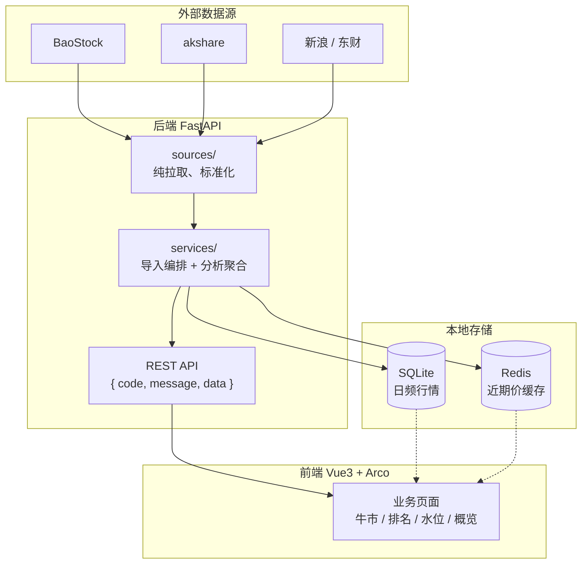

# Astock

Astock 是一个 **A 股历史行情 + 全球资产水位** 分析平台：从外部数据源增量拉取行情，缓存到本地 SQLite / Redis，再通过 Web 页面做牛市统计、成交额排名、全球资产价格水位与市场概览。

## 功能一览


| 页面       | 路径                    | 做什么                          |
| -------- | --------------------- | ---------------------------- |
| 牛市统计     | `/bull-market`        | 多轮牛市区间内，指数点位 / 成交额达标天数与极值    |
| 成交额排名    | `/turnover-rank`      | 大盘合计成交额 TopN、个股高水位成交额切片 TopN |
| 全球资产价格水位 | `/asset-price-levels` | 美股 / 贵金属相对历史最高点（ATH）的水位与结论标签 |
| 全球市场概览   | `/market-overview`    | 股指、汇率、国债、贵金属、原油等约 18 项概览     |


数据首次为空；本地跑起来后需在页面上触发一次「刷新全部数据」（见下文）。

## 技术方案


| 层   | 技术                                                     |
| --- | ------------------------------------------------------ |
| 后端  | FastAPI + SQLModel（SQLite）+ Redis + Pandas；开发用 Uvicorn |
| 前端  | Vue 3 + Vite + TypeScript + Arco Design Vue            |


业务范围（牛市区间、指数清单、全球资产、概览类目）主要由 `backend/astock/config/*.yaml` 驱动，改范围优先改 YAML，而不是硬编码。

数据流：




## 数据来源


| 数据                         | 来源                          | 落库 / 缓存        |
| -------------------------- | --------------------------- | -------------- |
| 上证 / 沪深300 / 创业板点位、两市合计成交额 | BaoStock                    | SQLite         |
| 科创50 点位                    | akshare（BaoStock 未覆盖）       | SQLite         |
| 个股高成交额切片（缺口日全市场 TopN）      | BaoStock 日更接口               | SQLite         |
| 全球资产 ATH / 近期价             | akshare                     | SQLite + Redis |
| 市场概览（美股指数、汇率、国债、美元指数等）     | akshare / 新浪 / 东财等，部分可复用本地库 | 主要 Redis       |


需能访问上述外网数据服务。Redis 不可用时后端会降级直连外源，但全球资产 / 市场概览体验会变差，**本地开发建议起一个 Redis**。

---


## 本地开发：从零跑起来


### 0. 环境要求

- Python **3.10+**（仓库常用 3.13）
- Node.js **22**（见根目录 `.nvmrc`），包管理器用 **pnpm 8+**
- Redis（本机安装即可）
- 能访问 BaoStock / akshare 相关外网


### 1. 克隆仓库

```bash
git clone https://github.com/gunerguner/Astock.git
cd Astock
```


### 2. 启动 Redis

全球资产与市场概览依赖 Redis 缓存。本机示例：

```bash
# macOS Homebrew
brew services start redis
# 或前台：redis-server
```

默认连接串为 `redis://localhost:6379/0`（与 `backend/.env.example` 一致）。

### 3. 后端：依赖 + 配置 + 启动

```bash
cd backend
python -m venv .venv
source .venv/bin/activate   # Windows: .venv\Scripts\activate
pip install -r requirements.txt

cp .env.example .env
```

按需编辑 `backend/.env`（一般开发可先不改）：


| 变量                      | 默认                         | 说明                       |
| ----------------------- | -------------------------- | ------------------------ |
| `DB_PATH`               | `db/astock.db`             | SQLite 路径（相对 `backend/`） |
| `FASTAPI_PORT`          | `8000`                     | 后端端口                     |
| `REDIS_URL`             | `redis://localhost:6379/0` | Redis                    |
| `LOG_LEVEL` / `LOG_DIR` | `INFO` / `logs`            | 日志                       |
| `ASSET_PRICE_CACHE_TTL` | `86400`                    | 全球资产等缓存 TTL（秒）           |


历史起始日、成交额阈值、个股 TopN 等业务常量在 `backend/astock/config.py` 与同目录 YAML 中，不是 `.env`。

启动后端（在已激活的 venv、且 cwd 为 `backend/`）：

```bash
python -m astock.main
```

成功后：

- API：`http://127.0.0.1:8000`
- OpenAPI（调试用）：`http://127.0.0.1:8000/docs`

首次启动会自动建表；库文件默认在 `backend/db/astock.db`。

### 4. 前端：依赖 + 配置 + 启动

新开一个终端：

```bash
cd frontend
pnpm install
```

开发环境变量在 `frontend/.env.development`（仓库已带示例，通常只需确认）：


| 变量                            | 说明                                                     |
| ----------------------------- | ------------------------------------------------------ |
| `VITE_API_BASE_URL`           | 开发保持为空；请求走同源 `/api`，由 Vite 代理到 `http://localhost:8000` |
| `VITE_ADMIN_REFRESH_PASSWORD` | 页面「刷新全部数据」确认密码（前端门禁，后端无鉴权）                             |


启动：

```bash
pnpm dev
```

浏览器打开终端提示的本地地址（一般为 `http://127.0.0.1:5173`）。

### 5. 第一次拉数据（推荐走页面）

刚启动时各页多为空，需要先导入历史数据：

1. 打开前端页面，点导航栏右上角的 **刷新** 按钮（「刷新全部数据」）。
2. 输入 `frontend/.env.development` 里配置的 `VITE_ADMIN_REFRESH_PASSWORD`。
3. 确认后会出现 SSE 进度弹窗，依次导入成交额、指数点位、个股切片、全球资产等；**首次全量可能较久**（个股阶段最慢），请保持网络畅通。
4. 完成后各业务页会自动 reload；之后可按需再刷新做增量。

导入依赖外网数据源，失败时可看后端 `backend/logs/` 或进度弹窗中的错误提示；确认 Redis 与后端已启动后再重试。

日常浏览四个菜单页即可验证功能，无需先记 API。需要调试接口时再打开 `http://127.0.0.1:8000/docs`。

### 6. 本地开发检查清单

- [ ] Redis 在 `6379` 可连
- [ ] `backend/.env` 已从 `.env.example` 复制
- [ ] `python -m astock.main` 无报错，`:8000` 可访问
- [ ] `pnpm dev` 已起，页面能打开
- [ ] 已用右上角刷新拉过至少一次数据
- [ ] `/bull-market`、`/turnover-rank` 等页面有表格数据