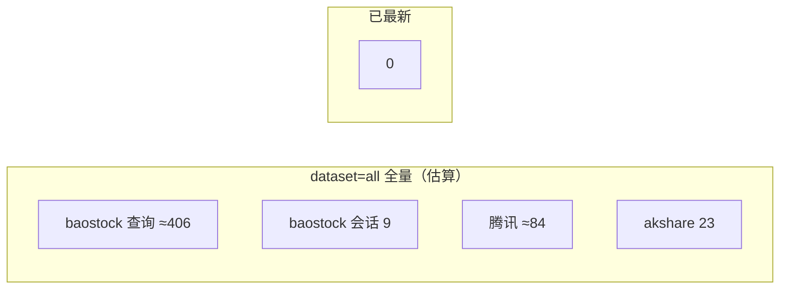

# 刷新场景外部数据源调用次数分析

> 基于当前代码（`backend/astock/`）静态梳理，统计的是**正常成功路径、无重试**下的调用次数。  
> 关联文档：[external-data.md — 各指标全流程](.agents/skills/astock/references/external-data.md)

## 1. 统计口径

| 数据源类型 | 计数规则 | 代码位置 |
|-----------|----------|----------|
| **baostock 数据查询** | 每次 `query_history_k_data_plus` / `query_all_stock` 计 **1** | `sources/baostock/*` |
| **baostock 会话** | 每次 `login`（配套 `logout`）计 **1 会话**；`baostock_session()` 或 ProcessPool `worker init` 各触发 1 会话 | `session.py` / `stock_importer.py` |
| **腾讯行情 HTTP** | 每批 `GET http://qt.gtimg.cn/q=` 计 **1**（每批最多 60 只，`TENCENT_BATCH_SIZE`） | `tencent_client.py` |
| **akshare 调用** | 每次代码显式调用 `ak.*` 计 **1**（底层 HTTP 次数不展开） | `akshare_client.py` / `market_overview/*` |
| **东财/新浪直连 HTTP** | 每次 `httpx.get` 计 **1** | `usd_index.py` 等 |

**不重复计入**：SQLite 读写、Redis 读写、本地 pandas 计算。

### 符号约定

| 符号 | 含义 | 典型量级（参考） |
|------|------|------------------|
| `M` | 全市场正常交易股票数（`query_all_stock` 结果） | ≈ 5 000 |
| `B` | 大市值股票数（腾讯市值快照后 `market_cap > 1000亿`） | ≈ 300–500（代码注释实测约 400） |
| `T_M` | 腾讯批次数 | `⌈M / 60⌉`，M=5000 时 ≈ **84** |
| `W` | ProcessPool worker 数 | **4**（`STOCK_HISTORY_FETCH_WORKERS`） |
| `N_ga` | 全球资产个数 | **22**（`global_assets.yaml`） |
| `N_mo` | 市场概览项数 | **15**（`market_overview.yaml`） |
| `N_mo_ak` | 市场概览 akshare 入口次数（冷启动） | **12**（见 §4） |
| `N_pt_bao` | baostock 源指数个数 | **3** |
| `N_pt_ak` | akshare 源指数个数 | **1**（科创50） |
| `N_to` | 成交额指数个数 | **2**（上证 + 深证综指） |

### 场景定义

| 场景 | 含义 |
|------|------|
| **全量刷** | 空库或 `sync_meta` 无水位，从 `START_DATE=2005-01-01` 拉至今 |
| **增量 1 天** | 库内水位为 **D-1**，日历今日为 **D**，存在 1 个新交易日需补齐 |
| **已最新再刷** | 跳过逻辑命中，不触网（见 §6） |

> **重要**：baostock / akshare 的「增量」只减少**返回行数**，**不减少请求次数**（仍按 `start_date → today` 发 1 次查询）。  
> **个股切片**在增量 1 天时仍会走完整筛选链路（代码池 + 市值 + 逐股日线），调用次数与全量同日刷新同量级，仅单次查询的数据量变小。

---

## 2. 管理员 SSE 导入（`POST /admin/data/import/stream`）

### 2.1 两市成交额（`dataset=turnover`）

| 数据源 | 全量刷 | 增量 1 天 | 已最新再刷 |
|--------|--------|-----------|------------|
| baostock 会话 | 1 | 1 | 0 |
| baostock `query_history_k_data_plus` | **2**（上证 + 深证综指） | **2** | 0 |
| 腾讯 / akshare / 东财 HTTP | 0 | 0 | 0 |

**说明**：一次 `fetch_turnover` 内 1 个 `baostock_session`，循环 2 个指数各 1 查询。

---

### 2.2 多指数点位（`dataset=point`）

| 数据源 | 全量刷 | 增量 1 天 | 已最新再刷 |
|--------|--------|-----------|------------|
| baostock 会话 | **3**（上证/沪深300/创业板各 1 次 `fetch_point`，各自独立 session） | **3** | 0 |
| baostock `query_history_k_data_plus` | **3** | **3** | 0 |
| akshare `stock_zh_index_daily` | **1**（科创50） | **1** | 0 |

**说明**：4 个指数串行；前 3 个走 baostock，科创50 走 akshare，各 **1 次**拉取函数调用（akshare 一次返回全历史后在本地按 `start_date` 过滤）。

---

### 2.3 个股高成交额切片（`dataset=stock`）

| 数据源 | 全量刷 | 增量 1 天（有新交易日） | 已最新再刷 |
|--------|--------|-------------------------|------------|
| baostock 会话 | **1 + W = 5**（代码池 1 会话 + 4 worker 各 login 1 次） | **5** | 0 |
| baostock `query_all_stock` | **1** | **1** | 0 |
| baostock `query_history_k_data_plus`（个股） | **B** | **B** | 0 |
| 腾讯行情 HTTP | **T_M** | **T_M** | 0 |
| akshare / 东财 HTTP | 0 | 0 | 0 |

**代入 M=5000、B=400、W=4 的估算**：

| 汇总项 | 全量 / 增量 1 天 |
|--------|------------------|
| baostock 数据查询合计 | **1 + B ≈ 401** |
| baostock 会话 | **5** |
| 腾讯 HTTP | **T_M ≈ 84** |

**说明**：

- 增量 1 天时 `hist_start_date = last_synced`（含水位的 D-1），每股仍 **1 次** baostock 查询，不是 1 次查全市场。
- 若 `turnover` 表为空会先嵌套执行 `import_turnover`（+2 查询、+1 会话，见 §2.1）。

---

### 2.4 全球资产 ATH（`dataset=global_assets`）

| 数据源 | 全量刷 | 增量 1 天 | 已最新再刷 |
|--------|--------|-----------|------------|
| akshare 历史行情 | **N_ga = 22**（美股 `stock_us_daily` + 期货 `futures_foreign_hist`，串行） | **22**（无按日增量；未命中跳过时仍全量拉） | **0**（`synced_today` 且已成功） |
| baostock / 腾讯 / 东财 HTTP | 0 | 0 | 0 |

**说明**：写路径不做「只拉 1 天」优化；同日第二次管理员刷新通常为 **0 次** akshare。

---

### 2.5 全量编排（`dataset=all`）

按 `import_orchestrator` 固定顺序：**turnover → point → stock → global_assets**。

#### 全量刷（空库，M=5000、B=400）

| 数据源 | 调用次数 |
|--------|----------|
| baostock 数据查询 | 2 + 3 + 1 + B = **2 + 3 + 1 + 400 = 406** |
| baostock 会话 | 1 + 3 + (1+W) = **9** |
| 腾讯行情 HTTP | **T_M ≈ 84** |
| akshare | 1（科创50）+ 22（全球资产）= **23** |
| 东财/新浪 HTTP | **0** |

#### 增量 1 天（turnover/point 各补 1 日，stock 跟跑，全球资产同日未刷过）

| 数据源 | 调用次数 |
|--------|----------|
| baostock 数据查询 | **406**（与上表相同） |
| baostock 会话 | **9** |
| 腾讯 HTTP | **≈ 84** |
| akshare | **23**（若全球资产今日已刷过则为 **1**） |

#### 已最新再刷（四阶段均跳过）

| 数据源 | 调用次数 |
|--------|----------|
| 全部 | **0** |

---

## 3. 全球资产价格水位 — 读路径刷新

**入口**：`GET /analysis/asset-price-levels`（非 SSE 导入；用户打开页面或 `force_refresh`）。

| 数据源 | 全量/冷缓存（Redis 全 miss） | 增量 1 天 / 热缓存 | 已最新（TTL 内） |
|--------|------------------------------|--------------------|--------------------|
| akshare | **N_ga = 22**（`backfill_from_akshare` 每股 1 次） | **0**（Redis `recent_closes` 命中） | **0** |
| SQLite `asset_high` | 读 22 行（不计外部） | 读 | 读 |

**`force_refresh=true`**：仍**不**绕过 TTL 内已有 Redis；仅对 miss 的 ticker 调 akshare，次数 = **缺失 ticker 数**（0–22）。

---

## 4. 全球市场概览 — 读路径刷新

**入口**：`GET /analysis/market-overview`（**无** SSE 导入阶段）。

### 4.1 冷启动（Redis 全 miss，需拉满 15 项）

按 `fetch_all_items` 拆分（成功路径、无重试）：

| 类目 | 项数 | 数据源 | akshare 次数 | 直连 HTTP |
|------|------|--------|--------------|-----------|
| 美股指数 | 3 | `ak.index_us_stock_sina` | **3** | 0 |
| 美元指数 | 1 | 东财 push2his + push2delay + 新浪现货 | 0–1（仅 EM 全失败时 `index_global_hist_em` 兜底） | **典型 3**（历史 1 + 现货 EM 1 + 现货新浪 1） |
| A 股指数 | 4 | `ak.stock_zh_index_daily` | **4** | 0 |
| 贵金属 + 原油 | 3 | `ak.futures_foreign_hist` | **3** | 0 |
| 汇率（美元/人民币） | 1 | `ak.currency_boc_sina` | **1** | 0 |
| 美债 5y/10y/30y | 3 | `ak.bond_zh_us_rate`（**一次调用填 3 项**） | **1** | 0 |
| **合计** | **15** | | **N_mo_ak = 12** | **典型 3**（美元指数） |

> 美元指数最坏情况：历史最多尝试 3 个 EM host（3 HTTP）+ akshare 兜底 + 点数不足时再加 1 次历史 → HTTP/akshare 可能高于上表；上表为**首次 host 成功**的常态。

### 4.2 热缓存 / 增量 / 已最新

| 条件 | 外部调用 |
|------|----------|
| 各项 Redis `recent` 在 TTL 内且 baseline 点数 ≥ 6 | **0** |
| 部分项 miss 或不足 | 仅对 **missing 列表** 调用，次数 ≤ 冷启动对应子集 |
| `force_refresh=true` | TTL 内**成功项仍 0**；仅重试失败标记 / 不足项 |

---

## 5. 只读分析 API（牛市统计 / 排名）

| API | 外部调用（任意刷新场景） |
|-----|--------------------------|
| `GET /analysis/bull-markets/turnover` | **0** |
| `GET /analysis/bull-markets/point` | **0** |
| `GET /analysis/turnover/ranking` | **0** |
| `GET /analysis/stock/ranking` | **0** |

依赖管理员导入写入的 SQLite，读接口不触网。

---

## 6. 跳过逻辑与 0 次调用条件

| 指标 | 条件 | 外部调用 |
|------|------|----------|
| turnover / point | `last_synced_date + 1 > today_local()` 且 `last_status=success` | **0** |
| stock | `max(turnover.date) ≤ stock_turnover.last_synced_date` | **0** |
| global_assets（写） | `synced_today(last_synced_at)` 且已成功且表非空 | **0** |
| 全球资产价（读） | Redis 全 ticker 命中且非 force 补拉 | **0** |
| 市场概览（读） | Redis 全项命中且 baseline 足够 | **0** |

---

## 7. 总览对照表

### 7.1 单指标 — 外部调用次数（正常路径）

| 指标 | 触发方式 | baostock 查询 | baostock 会话 | 腾讯 HTTP | akshare | 东财/新浪 HTTP |
|------|----------|---------------|---------------|-----------|---------|----------------|
| 两市成交额 | 导入 | 全量/增量：**2** | **1** | 0 | 0 | 0 |
| 多指数点位 | 导入 | 全量/增量：**3** | **3** | 0 | **1** | 0 |
| 个股切片 | 导入 | 全量/增量：**1+B** | **1+W** | **T_M** | 0 | 0 |
| 全球资产 ATH | 导入 | 0 | 0 | 0 | 全量/增量：**22**；跳过：**0** | 0 |
| 资产价格水位 | 读 API | 0 | 0 | 0 | 冷：**22**；热：**0** | 0 |
| 市场概览 15 项 | 读 API | 0 | 0 | 0 | 冷：**12** | 冷：**~3** |
| 牛市统计/排名 | 读 API | 0 | 0 | 0 | 0 | 0 |

### 7.2 `dataset=all` 合计（M=5000, B=400）

| 场景 | baostock 查询 | baostock 会话 | 腾讯 HTTP | akshare | 东财/新浪 HTTP |
|------|---------------|---------------|-----------|---------|----------------|
| 全量刷 | **406** | **9** | **≈84** | **23** | **0** |
| 增量 1 天 | **406** | **9** | **≈84** | **23**（全球资产已刷则 **1**） | **0** |
| 已最新再刷 | **0** | **0** | **0** | **0** | **0** |

### 7.3 失败重试放大（参考）

| 机制 | 配置 | 影响 |
|------|------|------|
| 市场概览单项 | `FETCH_RETRIES=4`，退避 `2s×attempt` | 单项 akshare/HTTP 最多 **4×** |
| 个股日线单股 | `FETCH_RETRIES=4` | 单股查询最多 **4×** |
| 美元指数 EM 历史 | 最多 **3** 个 host 轮询 | 失败时 HTTP 最多 **3×** 后再 akshare 兜底 |

---

## 8. 优化提示（与调用次数相关）

1. **成交额 / 点位**：已实现水位跳过与 `last_synced_date+1` 起点；已最新时 **0 调用**。
2. **个股切片**：增量 1 天仍 **O(B)** 次 baostock + **O(M)** 腾讯批次数，是 `dataset=all` 刷新耗时的主要来源。
3. **全球资产写路径**：按日跳过；读路径靠 Redis TTL（86400s）避免 22 次 akshare。
4. **市场概览**：不在 SSE 导入中；页面访问靠 Redis + 失败冷却（300s）控制调用频率。

---

*文档生成依据：`turnover_importer` / `point_importer` / `stock_importer` / `global_asset/refresh` / `market_overview_service` / `sources/*` 当前实现。*
